=======================
 Excel演習 その1
=======================

| 今回から、表計算ソフトのエクセルについて学んでいきます。 エクセルを使用する事で、簡単な表やグラフの作成、 またデータの管理や分析ができます。
| 人によっては学生のうちはあまり使用せず、社会人になってから活用することが増える方もいると思います。

.. note::
    ある程度高度な分析やグラフの作成に関しては、R等のプログラミング言語を使った方が簡単に出来るので、目的に応じて使い分けましょう。

| Excelは"spreadsheet"と呼ばれるアプリケーションのひとつです。
| 巨大な表の中にデータを配置して、それに対して合計や平均といった様々な表計算をおこなったり、グラフを描いたりすることが出来ます。
| また、データの整理整頓や計算だけでなく、計算式そのものをコピーして使いまわしたりすることが出来ます。

表の作成
^^^^^^^^^^^^^^^^^^^^^^^^^^^^^^^^^^^^^^^^^^^

セル
--------------------------------------------
| 表のマス目のひとつひとつをセル（cell）と呼びます。 Excelでは、セルにデータや数式を入力することによって、さまざまな計算を行います。
| 縦方向の並びは「列」で「A列、B列...」と数え、横方向の並びは「1列、2列...」と数えます。セルの位置は列と行の英数字を組み合わせ「A1」や「G23」の様に表します。
| クリックで選択したり、↑←↓→の矢印キー、TabキーやEnterキーによって隣のセルへ移動することが出来ます。

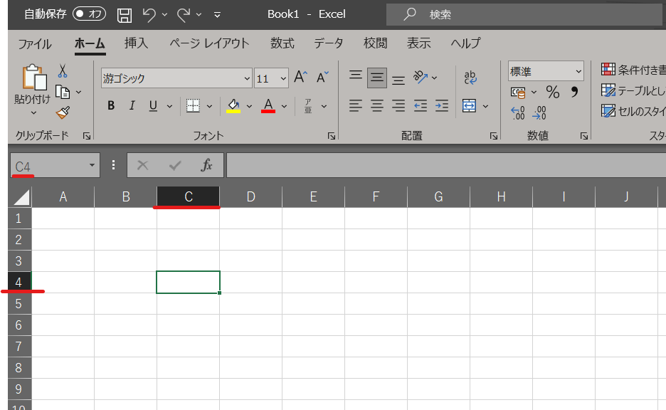

セルの選択
--------------------------------------------
| また、セルの選択方法として、ドラッグすることで複数のセルをまとめて選択できます。
| 列番号や行番号ボタンをクリックすると、指定列全体や指定行全体を選択できます。左上の角にある三角ボタンをクリックすると、シート全体を選択します。
| １箇所目の範囲を通常どおり選択した後、Ctrlキー(Macの方はCommandキー)を押しながら別の部分をドラッグすると、複数の範囲を同時に選択できます。
| 複数選択の後は、色を塗ったり行や列を挿入・削除などの操作を、複数の範囲に同時に行うことが出来ます。

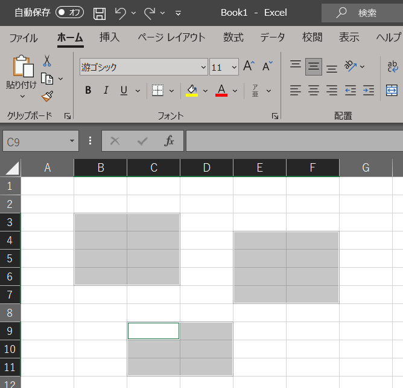

セルの追加と削除
--------------------------------------------
例えば、選択部分で「右クリック」→「挿入」で範囲選択の形に応じてセルを追加したり、「行全体」を選択した状態で「右クリック」→「挿入」すれば、１行追加したり出来ます。
また同様に、範囲選択後に「右クリック」→「削除」すれば、対象セルをまとめて消去できます。

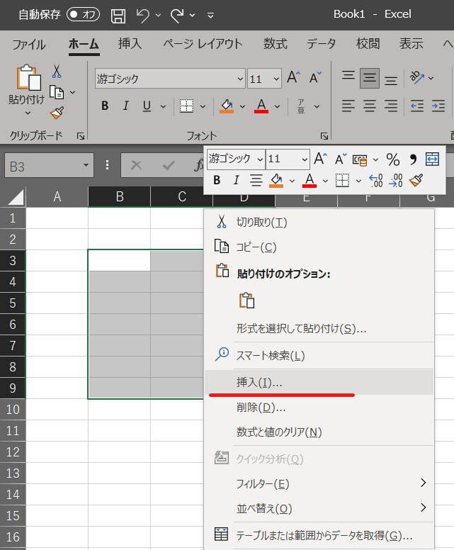

セルへの入力
--------------------------------------------
| 基本的なデータ入力方法はWordで表を書くのとほぼ同じです。

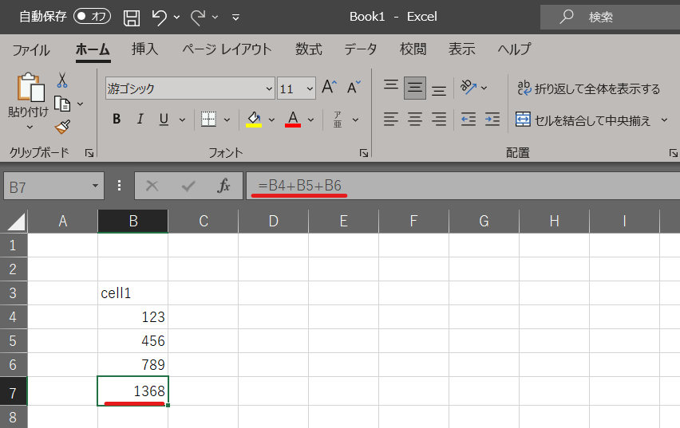

* 行や列の幅を変えるには、表の上端と左端の「A, B, C, ...」「1, 2, 3, ...」と見出しがついている部分でドラッグして調節します。
* 特定の文字列は自動的に書式変更されます。(例:12/31などはデフォルトでは日付に変換される)
* **半角の「=」で始まる文字列は数式として認識されます。**

といった点はWordと異なる点ですが、罫線の太さやセルの色、フォントを変える、セルの中での値の表示位置を中央寄せにしたりする所はWordと同じ様に上部のタブを使って編集します。

データの移動
--------------------------------------------
選択範囲の周囲の黒枠にマウスをポイントさせると、マウスカーソルの形が矢印に変化します。この時にドラッグすると、選択範囲の内容を別のセルに「移動」できます。

シート・ブック
--------------------------------------------
| Excelでは、複数枚の表を同時に扱うことが出来ます。画面左下に「Sheet1」などと書いたタブがあり、これを選択することで表を切り替えることが出来ます。
| 個々の表をシート(Sheet)と呼び、 シートを複数まとめたものをブック(Book)と呼びます。
| シート名のところで右クリックすると、シートの名前を変更、シートの削除したり、新しいシートの挿入が出来ます。
| ちなみに１つのシートには、およそ横16,000列、縦104万行程度の広さがあります。
| (個人の意見ですが)正直なところ、複数枚シートがあっても分かりにくいので、別のシートを作成するよりは別々のファイルで保存した方が分かりやすい気がします。

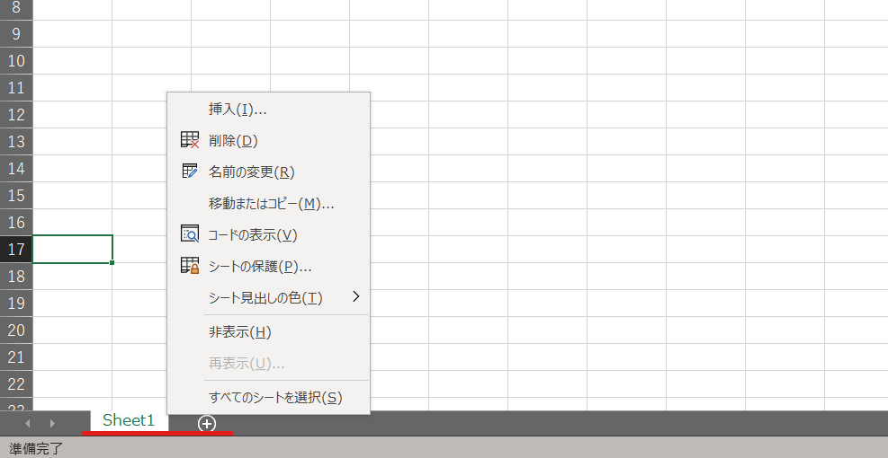

データの入力
---------------------------------------------
| Excelでのデータ入力は、「文字列」としての入力か、「数値」としての入力の2種類あります。
| 文字列は計算対象とならず、左揃えで表示されます。数値は計算対象となり、右揃えで表示されます。
| Excelには自動的に次のセルに連続性のある文字列や数値、関数を推測して入力する「自動入力（オートフィル）」という便利な機能があります。
| セルの右下にある■(フィルハンドル)にカーソルを合わせ、カーソルが ╋ に変わったら左クリックしてドラッグすると、ドラッグした範囲に自動的に値が記入されます。
| そのままドラッグすると同じ値のコピーが、Ctrlキー(Macの方はOptionキー)を押しながらドラッグすると連番が作成されます。
| コピーとオートフィルを上手く使い分けましょう。
| ホームタブの編集にあるフィルから少し複雑なオートフィルを行うことも出来ます。

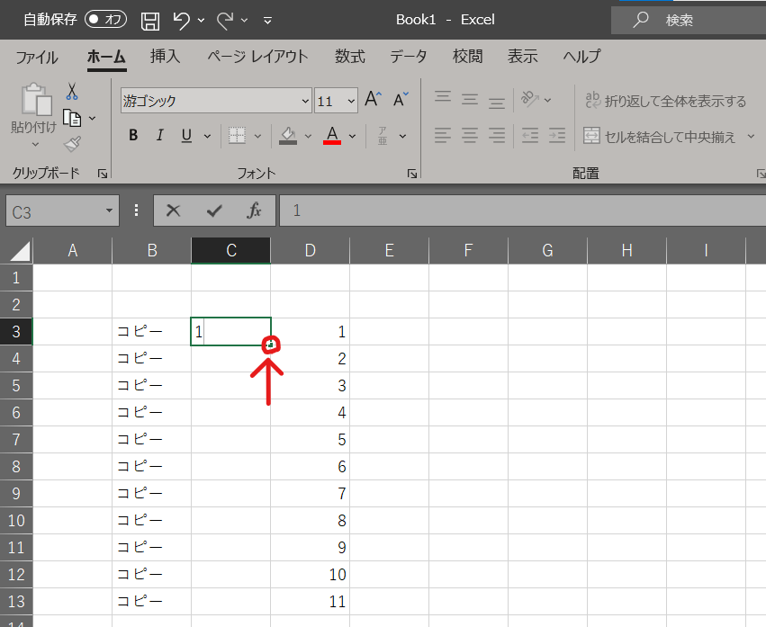

カーソルまとめ
--------------------------------------------

========================== ==================================================== ====================================================
 形                         カーソル位置                                          ドラッグ時の動作
========================== ==================================================== ====================================================
|cursor1|                   通常時                                               範囲選択
-------------------------- ---------------------------------------------------- ----------------------------------------------------
|cursor2|                   選択範囲の枠に接触中                                  データの移動
-------------------------- ---------------------------------------------------- ----------------------------------------------------
|cursor3|                   選択範囲の右下に接触中                                オートフィル
-------------------------- ---------------------------------------------------- ----------------------------------------------------
|cursor4|                   文字入力中                                            文字の入力
-------------------------- ---------------------------------------------------- ----------------------------------------------------
|cursor5| |cursor6|         列/行番号の境界に接触中                               セルの高さや幅の変更
========================== ==================================================== ====================================================

罫線の設定
--------------------------------------------
| Excel には元々薄い罫線が入っていますが、 この薄い罫線のみでは区別が難しい場合があります。また、この薄い罫線は印刷されません。そこで、この薄い罫線に様々な形状の罫線を入れることによって形を整えていきます。
| 罫線を入れた表を作成していくには、「フォント」の中の格子アイコンを使用します。 あるいは、セルを選択後、「右クリック」をして「セルの書式設定」を選択して、「罫線」の項目でも設定できます。

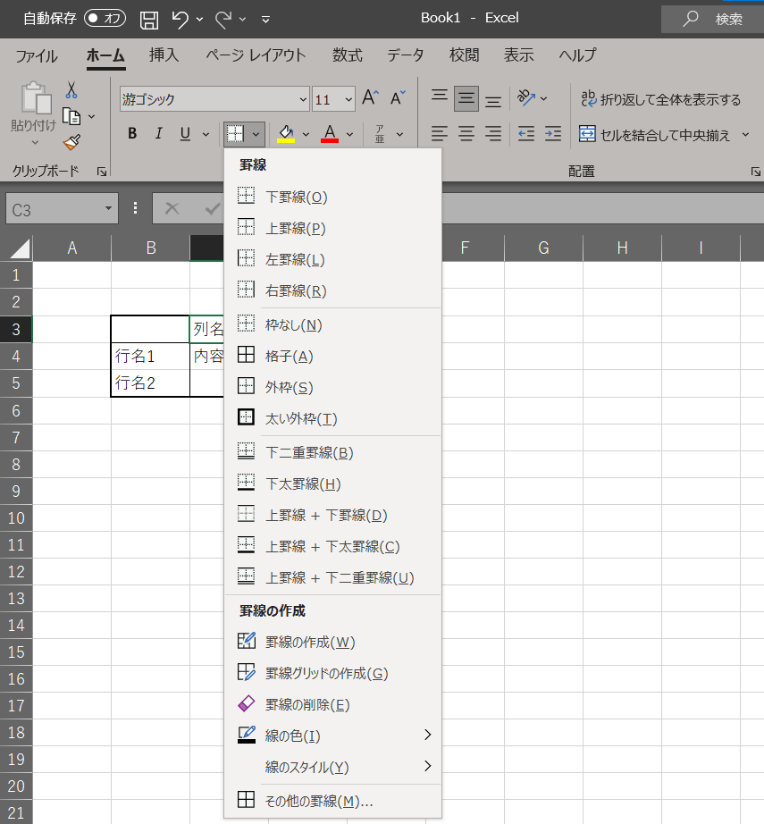

データの並べ替え
^^^^^^^^^^^^^^^^^^^^^^^^^^^^^^^^^^^^^^^^^^^^
| 一度データを入力し、テーブルを作成しておくと、データの並べ替えが容易に出来るようになります。並び替えのことは「整列」や「ソート」とも呼ばれます。
| データの値が小さいものから大きくなる順に並べることを「昇順」と言います。逆に大きいものから小さくなる順に並べることを「降順」と言います。
| 並び替えたい列を選択し、「ホーム」タブの「編集」という部分で昇順・降順を選ぶか、「データ」タブから並べ替えを選択します。
| 1行目が文字、2行目以降が数字の列の場合だと、自動的に先頭の1行目は見出しとして扱われソート対象にならないです。「データ」タブの並べ替えボタンからだとこれも設定できます。

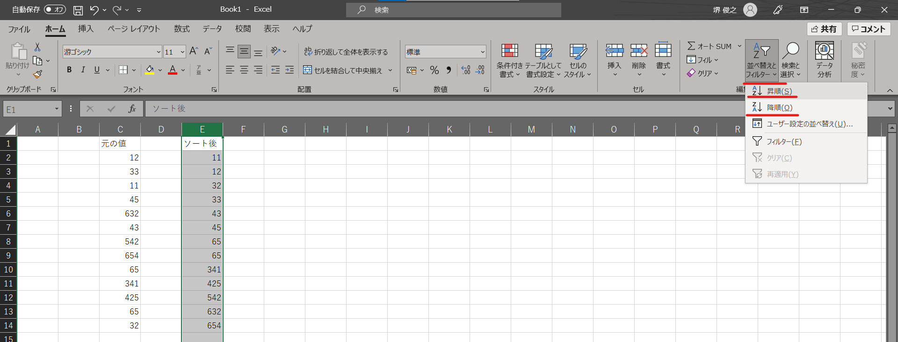

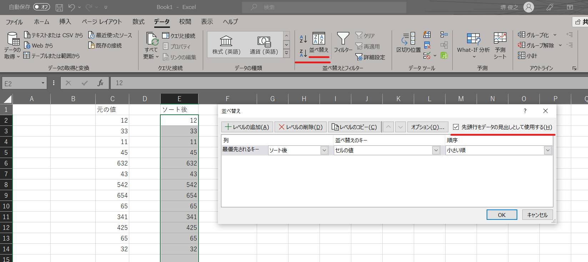

クロス集計
^^^^^^^^^^^^^^^^^^^^^^^^^^^^^^^^^^^^^^^^^^^^
| 作成したデータに対して、列の条件ごとにデータ件数を求めたり，総和や平均を求めたりすることをクロス集計といいます。
| 下の画像だと「ポジション別」の条件で集計を行う形です。
| Excelでは、「ピボットテーブル」という機能を使うことで、クロス集計をすることが出来ます。
| 「挿入」タブからピボットテーブルを選び、データ範囲を選択して作成します。

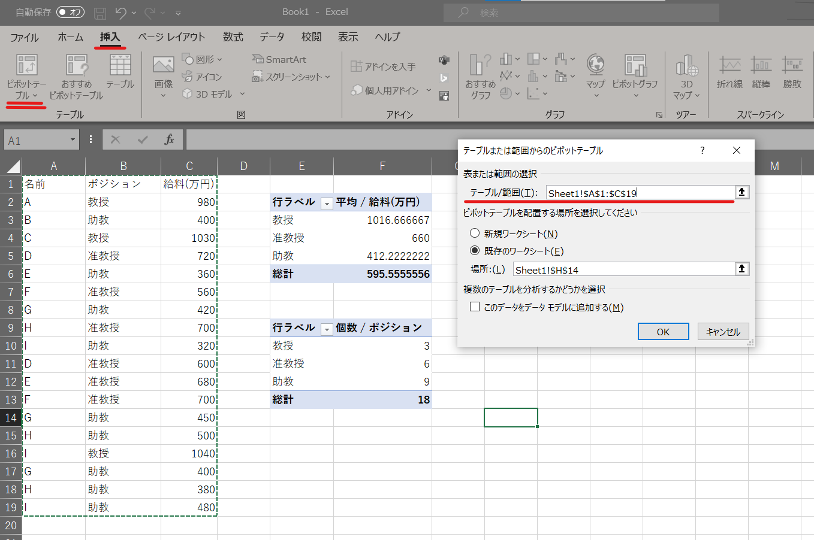

データ整理の練習
^^^^^^^^^^^^^^^^^^^^^^^^^^^^^^^^^^^^^^^^^^^^
| `[こちらの練習ファイル1] <_static/documents/excel/practice1.xlsx>`_ を開いて、データの並べ替えやクロス集計の練習をしてみましょう。
| 余裕があれば罫線などでテーブルの装飾も試してみて下さい。
| (注意)データセットは適当な値で作成しています。

数式
^^^^^^^^^^^^^^^^^^^^^^^^^^^^^^^^^^^^^^^^^^^^
| 上述した様な表を作成するだけであれば、Wordでも可能です。ExcelはWordと異なって、セルの値に対し様々な計算や処理を行うことが出来る点が大きな違いです。
| セルの入力でも少し触れましたが、Excelでは半角の「=」から始まるセルは数式として解釈され、「=」に続けて書いた式の結果が表示されます。
| 例えば適当なセルを選んで「=5+7」と入力すると、セルには「12」と表示されますが、数式バーには「=5+7」という式が表示されています。 単にセルに直接「12」と入力した場合と異なる形になります。

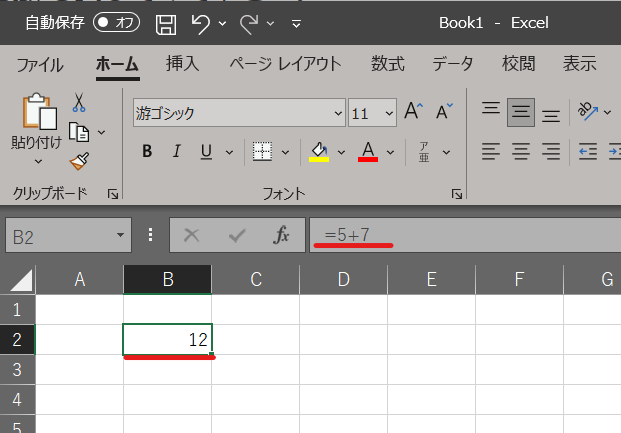

============================ ===================== ================
計算                          演算記号              例
============================ ===================== ================
足し算                        \+                     =5+3
引き算                        \-                     =5-3
かけ算                        \*                     =5*3
割り算                        /                     =5/3
べき算                        ^                     =5^3
============================ ===================== ================

セルの参照入力
^^^^^^^^^^^^^^^^^^^^^^^^^^^^^^^^^^^^^^^^^^^^
| 上記の数式では電卓の様に計算した結果をセルに出力するような形でしたが、Excelではセルの位置を参照し、そのセルの要素を計算に利用することが出来ます。
| 例えば「B列の2行目の値」+「B列の3行目の値」の様な形です。
| また、参照されているセルの値が変更されると、式が自動的に再計算されます。そのため、Excelでは計算処理も含めて表データとしてとどめておける形になります。

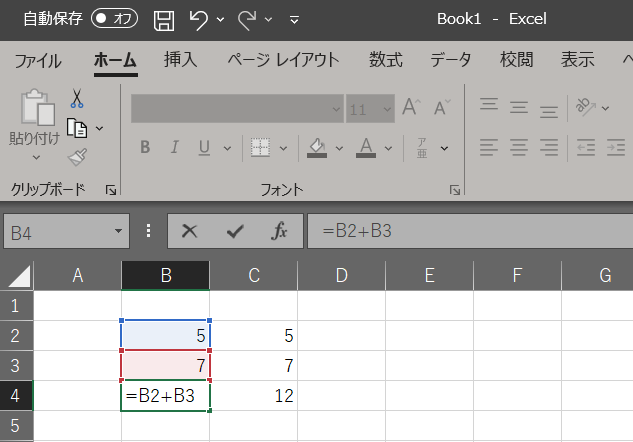

関数の入力
^^^^^^^^^^^^^^^^^^^^^^^^^^^^^^^^^^^^^^^^^^^^
| 足し合わせたいデータ数が数十、数百と増えるほど、コンピュータにその計算を任せるメリットは大きくなりますが、数式を自力で入力してセルを数百も指定するのは不便です。そういった場合に、Excelには関数という便利な機能があります。
| まずは使ってみましょう。
| 「合計」「平均」「データ件数」「最大値」「最小値」といった計算は非常によく使われるので、数式タブにボタンが用意されています。
| 結果を表示したいセルを選択し、数式タブのΣボタンから目的の計算を選択して、計算を適用する範囲を選択することで、範囲の値に対し計算を適用した結果が出力されます。
| なお、選択範囲に空白のセルがあっても合計や平均は正しく計算されます。

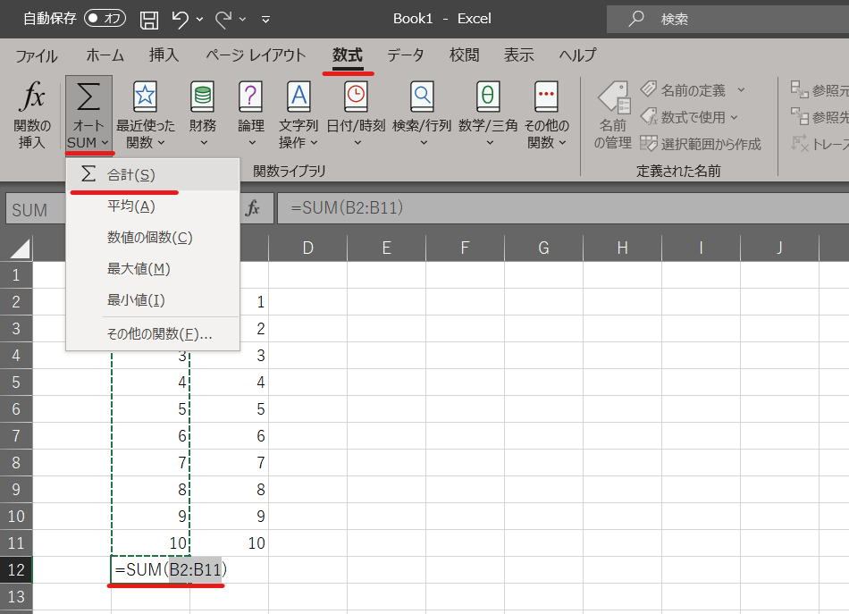

| この様に、Excelでは関数を使って一定範囲のセルに対し計算処理を行うことが出来ます。
| 上の例では数式タブのΣボタンから選んで使う様な形でしたが、通常は数式を入力する様な形で使用します。
| =関数名(入力1, 入力2, ...)のように入力することで、関数が利用できます。
| 例えばセルD4からD12までの合計を計算したい場合だと、「=SUM(D4:D12)」の様な形ですね。
| ここで「:」はD4"から"D12までの範囲選択を表しています。

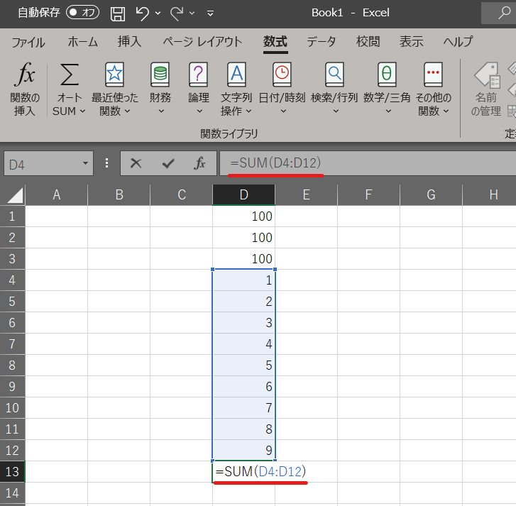

相対参照と絶対参照
^^^^^^^^^^^^^^^^^^^^^^^^^^^^^^^^^^^^^^^^^^^^
| 数式や関数式を他のセルにコピーした場合，式の中で参照しているセルは式のあるセルからの相対的な位置を保存してコピーされます。
| 例えばA6のセルにある「=sum(A2:A5)」を1列隣のB6にコピーするとセルの内容は「=sum(B2:B5)」と式の中のセルも1列隣になります。これを相対参照と言います。

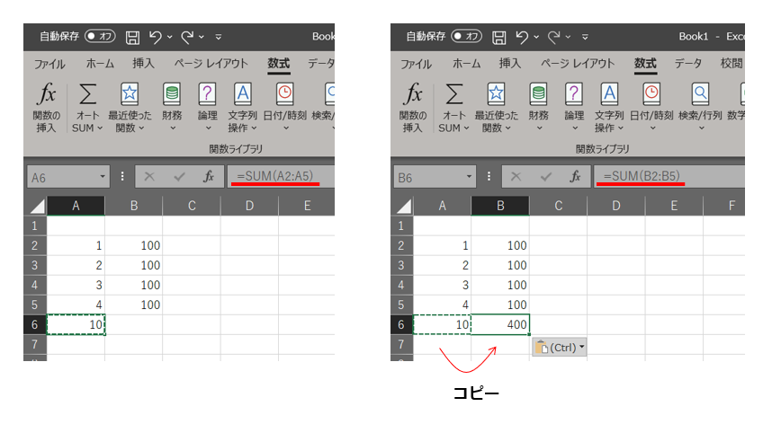

| これに対して，コピー先に関わらず特定のセル(行や列)を参照したい場合には行や列の名前の前に$記号をつけます。これを絶対参照と呼びます。
| 例えば、B2のセルにA2のセルの２割増しを計算するため定数1.2をセルC2に入れて、以下のように絶対参照で「=A2*$C$2」と表記しています。
| これを B3～B5にコピーすると「A2」に相当する部分はそれぞれA3～A5に変わりますが、C2については同じセルを参照します。
| 列の名前の前だけに$記号を付けると列のみ固定、行の名前の前だけに$記号を付けると行のみ固定といった使い方も出来ます。
| また、「$」記号を入力するのが大変な場合はキーボードの「F4」キーを使うと良いでしょう。カーソルを固定したいセル参照の文字に移動させ、F4キーを押すと自動で「$」記号を追加してくれます。

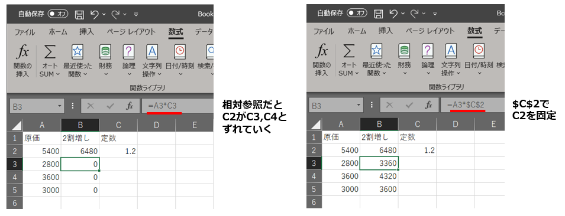

SUM関数の利用、相対・絶対参照の練習
^^^^^^^^^^^^^^^^^^^^^^^^^^^^^^^^^^^^^^^^^^^^
| `[こちらの練習ファイル2] <_static/documents/excel/practice2.xlsx>`_ を開いて、SUM関数や絶対参照を利用する練習をしてみましょう。
| 余裕があれば他の関数などの機能も試してみて下さい。