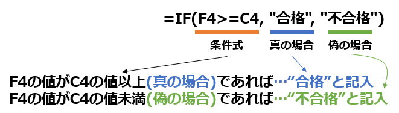
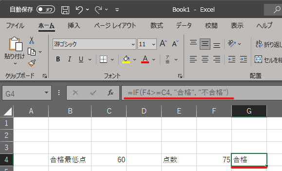
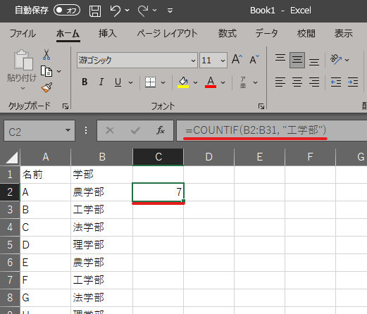
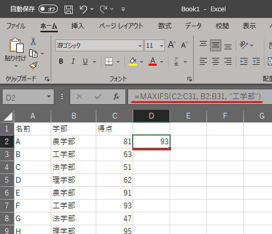
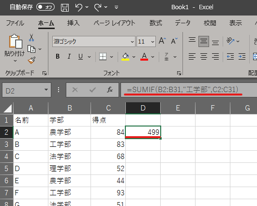
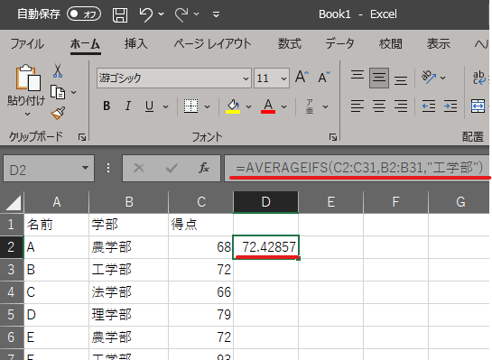
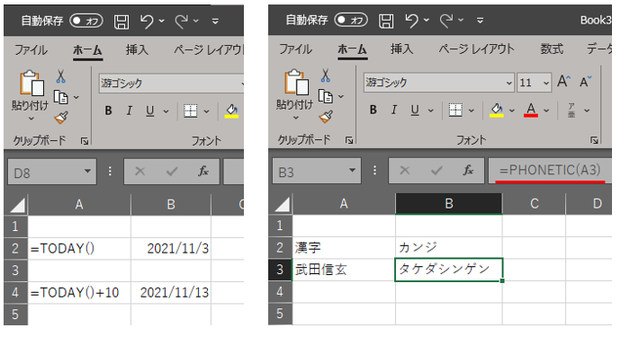

=======================
 Excel演習 その2
=======================

| Excelでは「関数」を利用すると、特定の処理を簡単に行えます。
| 関数は以下の様な数式を書くことで使用することが出来ます。

.. code-block:: markdown

    =関数名(引数, 引数, 引数…)

================ ============================================================ ======================================
 名前             意味                                                          例
================ ============================================================ ======================================
関数名            関数の名称                                                    SUM/AVERAGE/COUNTなど
---------------- ------------------------------------------------------------ --------------------------------------
引数              関数の計算に使用する値。複数ある場合は「,」で区切る              セルA1,セル範囲A1:A31など
================ ============================================================ ======================================

具体例

.. code-block:: markdown

    =SUM(A1:C10)

上の場合、A1セルからC10セルまでの範囲に書かれている数値を全て合計する関数を使用する形になります。

その他の関数
^^^^^^^^^^^^^^^^^^^^^^^^^^^^^^^^^^^^^^^^^^^^
| 先程はSUM関数を使用して合計値を計算しましたが、他にもいくつも関数はあります。数式のタブから関数の所を見るとどんな関数が用意されているのか分かります。
| ここでは良く使う有名どころをいくつか紹介します。

IF関数
^^^^^^^^^^^^^^^^^^^^^^^^^^^^^^^^^^^^^^^^^^^^
| IF関数を利用すると、特定の条件を満たしているかどうかによって、画面に表示する内容を変えることができます。
| 試験の結果によって合否・不合格判定を行うなど、２択を自動的に行う際に便利な機能です。
| 例えば、特定の条件を満たすデータに対して自動的にメッセージを出すようにすれば、データのチェックなどにも使えますので、IF関数を活用してみてください。

| IF関数は下のように３つの引数を必要とします。

.. code-block:: markdown

    =IF(論理式, 真の場合の処理, 偽の場合の処理)

| 論理式の部分にはA1 < 1000とか、SUM(A1:D1) >= 80、B1="割引"の様な判断条件を示す比較演算子が入ります。

=================== ======================================
比較演算子	         説明
=================== ======================================
<                   左辺は右辺より小さい
------------------- --------------------------------------
>                   左辺は右辺より大きい
------------------- --------------------------------------
<=                  左辺は右辺以下
------------------- --------------------------------------
>=                  左辺は右辺以上
------------------- --------------------------------------
=                   左辺と右辺は等しい
------------------- --------------------------------------
<>                  左辺と右辺は等しくない
=================== ======================================

| これらを利用して論理式を組み立てます。ただし、IF関数の論理式は比較を一度だけ行えます。つまり 100 < A2 < 200 のような書き方は、比較を２回行おうとしているのでエラーが発生します。
| ３つのものを比較するためには、ANDやORという特別な関数を利用する必要があります。(練習問題IF関数その2参照)

.. code-block:: markdown

    =IF(論理式, 真の場合の処理, 偽の場合の処理)

| 論理式の結果が真の場合の処理・偽の場合の処理の部分では、以下のような処理が行なえます。

=================== ====================================== ============================================================================
処理	             例	                                    処理内容
=================== ====================================== ============================================================================
文字列を表示         "クリア" (文字の場合は「"」で囲う。)     指定の文字を表示します。
------------------- -------------------------------------- ----------------------------------------------------------------------------
計算                 A1+B5                                  計算結果を表示します。
------------------- -------------------------------------- ----------------------------------------------------------------------------
他の関数を実行       SUM(A1:A4)                              関数の計算結果を表示します。
=================== ====================================== ============================================================================

具体例をいくつか載せておきます。

1. F4の値がC4の値以上であれば合格とセルに記入し、そうでなければ不合格と記入される。

.. code-block:: markdown

    =IF(F4>=C4, "合格", "不合格")

2. A1の値が"割引"であればA2に0.8かけた値をセルに記入し、そうでなければ元々のA2の値がそのまま記入される。

.. code-block:: markdown
    
    =IF(A1="割引", A2*0.8, A2)

3. D4に文字が記入されていなければ、"記入してください"と表示され、元々何か記入されていれば何も記入されない。

.. code-block:: markdown

    =IF(D4="", "記入してください", "")

練習問題(IF関数)
^^^^^^^^^^^^^^^^^^^^^^^^^^^^^^^^^^^^^^^^^^^^
`[こちらの練習ファイル3] <_static/documents/excel/practice3.xlsx>`_ からIF関数を利用する練習をしてみましょう。

練習問題(IF関数その2)
^^^^^^^^^^^^^^^^^^^^^^^^^^^^^^^^^^^^^^^^^^^^
`[こちらの練習ファイル3_2] <_static/documents/excel/practice3_2.xlsx>`_ からIF関数で複数条件を利用する練習をしてみましょう。

様々な関数の利用の練習
^^^^^^^^^^^^^^^^^^^^^^^^^^^^^^^^^^^^^^^^^^^^
ここからは `[こちらの練習ファイル4] <_static/documents/excel/practice4.xlsx>`_ を開いて、様々な関数を利用する練習をしてみましょう。

個数を数える(COUNT関数)
---------------------------------
テーブル上のデータの数をカウントしたり、条件に当てはまるデータの数を知ることが出来ます。

==================================== ==================================================== ====================================================
 関数名                               意味                                                 例
==================================== ==================================================== ====================================================
=COUNT(範囲)                          範囲内の数値の個数を数える                             =COUNT(A2:A31)
------------------------------------ ---------------------------------------------------- ----------------------------------------------------
=COUNTA(範囲)                         範囲内の空白でないセルの数を数える                      =COUNTA(A2:A31)
------------------------------------ ---------------------------------------------------- ----------------------------------------------------
=COUNTIF(範囲, 条件)                  範囲内で条件を満たすセルの個数を数える                  =COUNTIF(B2:B31,"工学部"), =COUNTIF(B2:B31,">20000")
------------------------------------ ---------------------------------------------------- ----------------------------------------------------
=COUNTIFS(範囲, 条件, 範囲, 条件...)   範囲内で複数の条件を満たすセルの個数を数える            =COUNTIFS(B2:B31,”工学部”,D2:D31,”>20000”)
==================================== ==================================================== ====================================================

最大値・最小値を求める(MAX関数, MIN関数)
-----------------------------------------------
それぞれ選択したセルに入力されている値の中で、最も大きな値と最も小さな値を自動的に選んで表示します。

==================================== ======================================================= ====================================================
 関数名                               意味                                                    例
==================================== ======================================================= ====================================================
=MAX(範囲)                            範囲内の最も大きな値を表示                                =MAX(A2:A31)
------------------------------------ ------------------------------------------------------- ----------------------------------------------------
=MIN(範囲)                            範囲内の最も小さな値を表示                                =MIN(A2:A31)
------------------------------------ ------------------------------------------------------- ----------------------------------------------------
=MAXIFS(対象範囲, 条件範囲, 条件...)    複数条件を満たすものの対象範囲内で最も大きな値を表示        =MAXIFS(C2:C31,B2:B31,”工学部”,D2:D31,”>20000”)
==================================== ======================================================= ====================================================

大体分かってきたと思いますが、どんな関数でもほとんど使い方は同じで「=関数名(適用する範囲)」の様な形で使用します。

合計を求める(SUM関数)
---------------------------------
SUM関数は先程やりましたが、こちらも条件付きなどを適用することが出来ます。

============================================== ========================================================= =========================================================
関数名                                          意味                                                       例
============================================== ========================================================= =========================================================
=SUM(範囲)                                     範囲内の数値の合計を求める                                   =SUM(A2:A31)
---------------------------------------------- --------------------------------------------------------- ---------------------------------------------------------
=SUMIF(条件範囲, 条件, 対象範囲)                 条件を満たすものの対象範囲内の合計を求める                    =SUMIF(B2:B31,"工学部", C2:C31)
---------------------------------------------- --------------------------------------------------------- ---------------------------------------------------------
=SUMIFS(対象範囲, 条件範囲, 条件...)             複数条件を満たすものの対象範囲内の合計を求める                =SUMIFS(C2:C31,B2:B31,”工学部”,D2:D31,”>20000”)
============================================== ========================================================= =========================================================

平均を求める(AVERAGE関数)
---------------------------------
合計値や最大値と同様に、平均値も求めることが出来ます。

======================================== ==================================================== ====================================================
 関数名                                   意味                                                 例
======================================== ==================================================== ====================================================
=AVERAGE(範囲)                            範囲内の数値の平均値を求める                            =AVERAGE(A2:A31)
---------------------------------------- ---------------------------------------------------- ----------------------------------------------------
=AVERAGEIF(条件範囲, 条件, 対象範囲)       条件を満たすものの対象範囲内の平均値を求める              =AVERAGEIF(B2:B31,"工学部", C2:C31)
---------------------------------------- ---------------------------------------------------- ----------------------------------------------------
=AVERAGEIFS(対象範囲, 条件範囲, 条件...)   複数条件を満たすものの対象範囲内の平均値を求める          =AVERAGEIFS(C2:C31,B2:B31,”工学部”,D2:D31,”>20000”)
======================================== ==================================================== ====================================================

その他(TODAY関数、PHONETIC関数...etc)
----------------------------------------------------------------

| 計算とはまた違った関数として今日の日付を表示するTODAY関数や、フリガナを出力するPHONETIC関数などもあります。
| より複雑なIF構文や計算式をExcel上で展開する際に便利なLET関数など、関数をより便利に使う関数というものもあったりします。
| 今回紹介した関数はほんの一部なので、気になる人は他にどんな関数がExcelに用意されているか調べてみると良いでしょう。

関数の利用問題(演習課題)
^^^^^^^^^^^^^^^^^^^^^^^^^^^^^^^^^^^^^^^^^^^^
| `[こちらの練習ファイル5] <_static/documents/excel/practice5.xlsx>`_ を開いて、これまで学習した関数や数式を用いて問題を解いてみましょう。
| **演習課題その2は、編集したファイルの最初のページの右上に「氏名・所属」を記入してPandaの課題から提出して下さい。**
