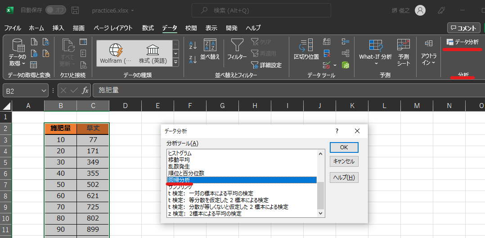

=======================
 Excel演習 その3
=======================

グラフの描写
^^^^^^^^^^^^^^^^^^^^^^^^^^^^^^^^^^^^^^^^^^^^

| 今回はExcelのグラフ機能について解説をします。Excelでは、レポートや発表資料などを作る際に便利なグラフを簡単に作れます。棒グラフ、円グラフなどデザインも幾つかの種類用意されています。
| 作成したグラフはWordやPowerPointなどに貼り付けることで、データを掲載するために使用することも出来ます。Excelでデータをまとめてグラフを作成し、レポートや発表などに活用するのも良いでしょう。

基本的なグラフの作成方法
------------------------------------------------

| それでは実際にグラフを作る方法について解説していきます。
| Excelではセルに入力された値をそのままグラフにできます。
| 今回は `[こちらの練習ファイル] <_static/documents/excel/practice6.xlsx>`_ を利用して、実際に操作しながら色々なグラフを作成してみましょう。

| グラフは以下の手順で簡単に作成できます。
| グラフに必要な範囲を選択します。とりあえず「前年実績」をグラフ化してみましょう。
| このとき「前年実績」でまとまっている一連の値のことを、Excelでは「データ系列」あるいは単に「系列」と呼びます。
| 範囲を選択したら、「挿入」タブ →「グラフ」グループにある「縦棒」のボタンなどをクリックすると、グラフが自動的に作成されます。

.. note::
    | 「見出し」部分も一緒に選択しておくと、グラフ内にラベルが自動入力されるので便利です。
    | 見出しとして認識できる範囲は、データの上と左にある１行・１列分が基本です。

| 範囲選択を工夫すれば、データが離れた場所にある場合でもグラフ化できます。
| たとえば、「関東圏」と「関西圏」のデータを並べてグラフ化したいなら、以下のように範囲選択しましょう。
| 複数の範囲選択の方法は以前もやりましたが、一箇所目をドラッグで選択した後、Ctrlキー(MacはCommandキー)を押しながら二箇所目を追加選択します。

データソースの選択
------------------------------------------------

| Excelの自動選択では、思い通りのラベル選択やx/y軸のデータが選択されないこともあります。
| そんな場合は「データの選択」から、選択したいデータやラベルの編集を行います。
| 作成したグラフをクリックし、「グラフのデザイン」タブ→「データの選択」ボタンをクリックするか、グラフを右クリックして「データの選択」を選択します。

| 複数の系列を含むグラフの場合は、左の「系列1」等と書いてある部分で、編集したい系列を選択します。
| 右の「編集」ボタンをクリックすることで、ラベルを編集することが出来ます。ラベルにしたい文字が入力してあるセルの範囲を選択しても良いですし、自分で直接「XXX, YYY, ZZZ」の様にカンマ区切りで打ち込んでも大丈夫です。

| 表示したいデータを選択し直すには、「グラフデータの範囲」を変更したり、左の項目を追加・編集することで、表示させたいデータの選択を行うことが出来ます。

.. figure:: _static/images/excel/graph_select3.png

グラフの種類
------------------------------------------------
| グラフには様々な種類があります。「挿入」メニューには、様々なグラフを作るためのボタンが並んでいますので、適切なグラフを選んで作成してください。状況にあわせて見やすいグラフの種類を選びましょう。

棒グラフ

折れ線グラフ

円グラフ

.. figure:: _static/images/excel/graph_circle.png

.. note::
    | 円グラフは良く見かけるグラフではありますが、データを表現する方法としては分かりにくい表現方法の一つになります。可能な限り使用は避けた方が良いでしょう。

グラフの編集
------------------------------------------------
| 作成したグラフは、レイアウトやデザインを編集することができます。
| グラフをクリックすると、「グラフのデザイン」と「書式」という新しいタブが現れます(Officeのバージョンによっては「グラフツール」等の場合もあります)。このタブからグラフの細かい編集ができます。

| グラフのデザインの「グラフ要素を追加」から、軸のラベルや凡例など、グラフに様々な要素を追加できます。グラフが分かりやすくなるように適宜追加してください。追加した要素はそれぞれ、マウスでドラッグすることで位置を調整できます。
| 追加出来る要素は以下の様なものになります。

==================================== ==================================================== 
 要素                                 調整対象                                             
==================================== ==================================================== 
グラフエリア                          背景部分、グラフ全体のサイズや背景色。
------------------------------------ ----------------------------------------------------
プロットエリア                        グラフ描写部分。グラフ自体の大きさ。        
------------------------------------ ----------------------------------------------------
グラフタイトル                        グラフの表題。  
------------------------------------ ----------------------------------------------------
軸ラベル                              縦軸と横軸に対する説明。
------------------------------------ ----------------------------------------------------
データラベル                          各項目の正確な値。
------------------------------------ ----------------------------------------------------
凡例                                  どの色のグラフが何の項目を示すかの対応表      
------------------------------------ ----------------------------------------------------
目盛線                                縦横の罫線。  
==================================== ====================================================

| 「書式」タブでは、グラフエリア内にある各パーツをクリックし、色を塗ったり枠線を描いたりフォントを変えることができます。
| また、より細かい調整をしたい場合、調整したい要素を右クリックして、「XXの書式設定」を選びましょう。

| 右端近くにある「グラフの種類変更」で、一旦作成したグラフを別の種類に変更できます（折れ線グラフ→円グラフなど）。

第２軸の利用
------------------------------------------------

| スケールの異なる２系統のデータがある時に、縦軸をもう一つ追加したい場合があります。たとえば以下のような状況です。

| この様に、スケールの異なるもう一つの軸を第2軸と呼び、以下の方法で追加することが出来ます。
| 第２軸に移動させたいデータ系列を選択し、右クリックから書式設定パネルを開きます。書式設定パネルの「系列のオプション」欄の「使用する軸」項目で「第２軸」を選択します。

軸の最大・最小値を設定する
------------------------------------------------
| 値の変動が小さい場合、そのままグラフ化しただけでは違いが見えにくいことがあります。
| この様な場合は、縦軸の範囲を調整し、違いを見やすくすることが可能です。
| グラフの縦軸の数値を右クリックし、軸の書式設定を選択します。「軸のオプション」欄には「最小値」「最大値」を入力する欄があるので、そこで適切な値を設定します。
| ただし、軸の表示範囲を変えて、差を強調することは、恣意的な印象操作につながることもあるので注意して活用しましょう。

Wordでグラフを利用する
------------------------------------------------
| 通常Excelで作成した表やグラフは、Wordなど他のアプリケーションに貼り付け、レポートなどの資料の一つとして活用することが多いです。貼り付ける方法は簡単で、グラフを右クリックやCtrl+C(Mac:Command+C)で「コピー」して右クリックやCtrl+V(Mac:Command+V)で「貼り付け」すれば利用できます。
| 貼り付けの際にはいくつかの方法があります。

Microsoft Excelグラフ オブジェクト
そのまま直接貼り付けるとこの貼り付け方になります。Word上でグラフの再編集ができる貼り付け方ですが、Word上で少し色やレイアウトが変化してしまう場合もあるようです。

図(拡張メタファイル, PNG, JPG)として貼り付け
Word上で再編集することは出来ませんが、Excel上で作成したデザインをそのまま貼り付けることが可能です。

.. note::
    | Microsoft Excelグラフ オブジェクトとして貼り付けると、Wordでの処理が重くなる可能性があります。
    | 通常はPNGなどの画像として貼り付けるのが良いでしょう。

グラフ描写の練習問題
^^^^^^^^^^^^^^^^^^^^^^^^^^^^^^^^^^^^^^^^^^^^
| `[こちらの練習ファイル7] <_static/documents/excel/practice7.xlsx>`_ を開いて、グラフ描写の練習をしてみましょう。
| 練習ファイル7のデータを使って以下の様な図を作成してみて下さい。(大体同じに出来ればいいです。)

回帰分析などの簡単な分析
^^^^^^^^^^^^^^^^^^^^^^^^^^^^^^^^^^^^^^^^^^^^
| 散布図を描いた際に、回帰分析を行うことが良くあります。y = ax + b の様な形でx軸とy軸の相関を見る形です。
| 近似式だけを表示するのであれば、グラフ要素から近似直(曲)線を追加し、その書式設定から近似式を表示することが出来ます。

| 別のやり方として、Excelには分析ツールというものがあり、簡単な回帰分析や統計解析などを行うことが出来ます。
| 「データ」タブにありますが、初期状態のExcelでは無いかもしれません。その場合は「ファイル」→(「その他」→)「オプション」→「アドイン」からデータ分析を追加します。(Macの場合は画面上部のメニューからツール→Excelアドイン)
| アドインとはその名の通り、Excelへ新たな機能を追加する事を指します。

| データの範囲を選択して「ホーム」タブのデータ分析ボタンを押すと、Excelがいくつかのグラフを候補として色々と出してくれます。
| 今回は、「データ」タブのデータ分析ボタンから、回帰分析などの行いたい分析ボタンを選択します。そして分析対象のデータ範囲を入力することで、実際にExcelが分析をしてくれます。
| ここでは出力された結果の細かい解説は行いませんが(2回生の講義等で習うかと思います。)、他にも様々な分析を行うことが可能ですので、使ってみて下さい。

データ分析の練習問題
^^^^^^^^^^^^^^^^^^^^^^^^^^^^^^^^^^^^^^^^^^^^
| `[こちらの練習ファイル8] <_static/documents/excel/practice8.xlsx>`_ を開いて、データ分析の練習をしてみましょう。
| データ分析ツールだけでなく、これまでに学んだ知識を使ってもらっても構いません。

シミュレーションの練習問題
^^^^^^^^^^^^^^^^^^^^^^^^^^^^^^^^^^^^^^^^^^^^
| Excelの数式を用いる事でシミュレーションの計算を行うことが出来ます。
| シミュレーション(simulation)とは考察の対象をモデルを用いて模擬することです。現実的にデータを収集することが難しい対象や、事前にシミュレーション結果を用いて実験の検討を行ったりするときに使用します。
| 今回は、補食-被食者モデル(ロトカ・ヴォルテラの方程式)をExcel上で実装してみます。
| 捕食―被食者モデルとは、時間の経過に応じて、捕食者の数と被食者の数がどの様な変遷をとるかをモデル化したものです。式で表すと

という風に表せます。被食者が増えると捕食者も増えていくが、捕食者が増えすぎると被食者の減りが激しくなり、被食者の数もそれに応じて減少していく…という様な関係性になります。

.. figure:: _static/images/excel/Lotka_Volterra_equation_Maple_plot.png

| `[こちらの練習ファイル9] <_static/documents/excel/practice9.xlsx>`_ を開いて、捕食-被食者関係のシミュレーションをつくってみましょう。
| また、シミュレーション結果をグラフ化して確認してみましょう。

画像は `[ロトカ・ヴォルテラの方程式] <https://ja.wikipedia.org/wiki/%E3%83%AD%E3%83%88%E3%82%AB%E3%83%BB%E3%83%B4%E3%82%A9%E3%83%AB%E3%83%86%E3%83%A9%E3%81%AE%E6%96%B9%E7%A8%8B%E5%BC%8F>`_ より引用。

.. note::
    | ロトカヴォルテラ方程式を解くには微分方程式を解く必要がありますが、今回はオイラー法を用いて解いています。
    | ExcelにはVBAと呼ばれるプログラミング言語の機能が実装されており、VBAを用いる事で別の解法で微分方程式を解くことも出来ます。
    | ただ、VBAでやるくらいならRやMathematicaでやった方が良いと思うので今回は割愛しています。
