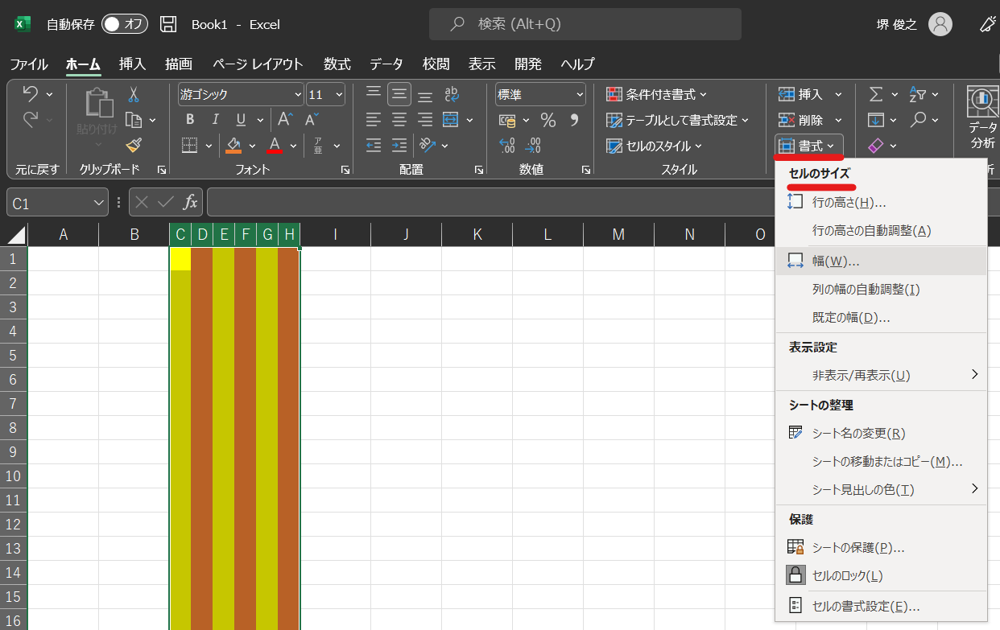
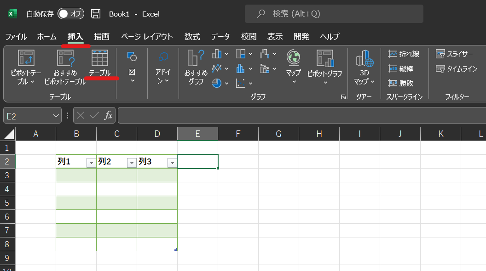
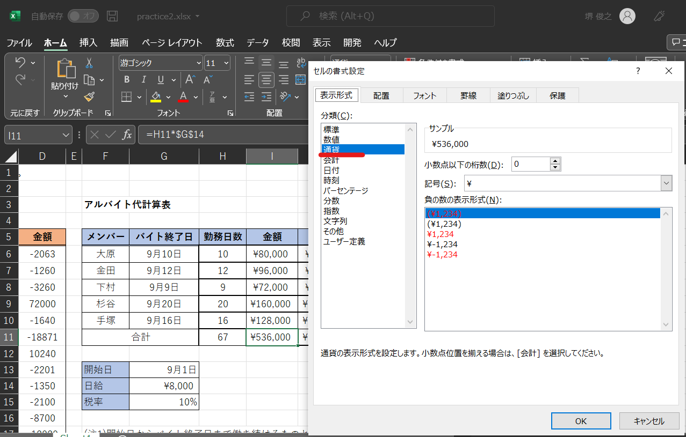
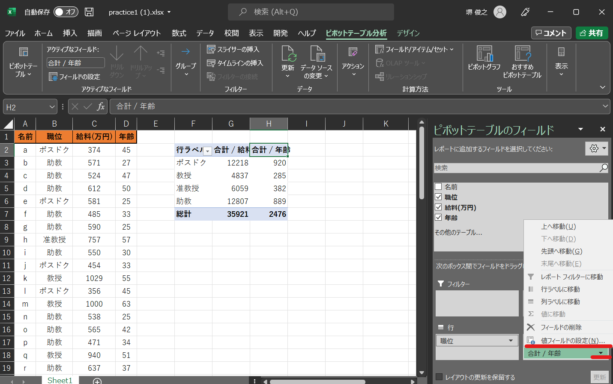

=======================
 Excel演習 その他
=======================

**Q. エクセルの作業はマウスを使うのが一般的でしょうか。コントロールキーやショートカットの使用法があれば教えてください。**

A. 範囲選択などマウス(トラックパッド)を用いた方が選択しやすい場合もあるので、Wordと違ってキーボードにこだわる利点は小さくなります。ただ、Ctrl+Z(元に戻す)やCtrl+C/V(コピペ)など、PCで基本的に共通のショートカットは一通り使えますし、また、Excel特有のショートカットキーとしては以下の様なものがあります。他にもたくさんあるので便利だと思うものは使ってみると良いでしょう。

==================================== ===================================================================
 ショートカットキー()内はMac用          動作                                            
==================================== =================================================================== 
Shift + Space                         選択範囲を行全体に拡張する
------------------------------------ -------------------------------------------------------------------
Ctrl + Space                          選択範囲を列全体に拡張する      
------------------------------------ -------------------------------------------------------------------
Shift + 方向キー                       選択範囲を拡張する
------------------------------------ -------------------------------------------------------------------
Ctrl(Command) + Shift + 方向キー       先頭行、末尾行、左端列、または右端列まで選択範囲を拡張する
------------------------------------ -------------------------------------------------------------------
Ctrl(Command) + -                     選択範囲のセルを削除する
------------------------------------ -------------------------------------------------------------------
Ctrl(Command) + Shift + "+"           セルを挿入する
==================================== ===================================================================

**Q. セルの幅を全ていっぺんに変えるにはどうしたらよいですか。Excelのセルの幅を均等に整える方法がよく分かりません。**

A. ホームタブ内の右の方にある「書式」という所からまとめて変更することが出来ます。

**Q. 練習問題のファイルにあるような縞々の色の模様はどうやってつけているのでしょうか？**

A. Excelの中にテーブルを挿入することができます。このテーブルのレイアウトから縞模様等を選びます。基本的な表デザインはテーブルを挿入して作ってみても良いでしょう。

**Q. SUMやIF関数を使った後に、同じ数式をほかの列や行にも適応しようとしたとき、出た値は正しいのですが、セルの左上に小さな直角三角形マークと（注意！）のマークが出るのですが問題はないのでしょうか**

A. 隣の列や行と異なる計算をするとその様なアラートが出る場合があります。目的の計算が出来ていれば気にしなくても大丈夫です。

**Q. 自動入力が思うように機能しないことがあった。**

A. 相対参照・絶対参照が上手く指定できていなかったのかもしれません。

**Q. アルバイト代計算表の課題のところなのですが、金額や税金、支給金額の合計に¥マークがつかないです。どうしてなのでしょうか。**

A. Excelのセルには書式が設定されています。目的の範囲を選択→右クリックして「セルの書式設定」から設定することができ、そのセルが何を記入されているのかや表示する単位などを決めることが出来ます。

**Q. ピボットテーブルの一番右の列が合計／年齢となっていて直し方がよく分かりません。**

A. ピボットテーブルを作成し、右側のピボットテーブルのフィールドから設定できます。変更したい列の部分を選び、「値フィールドの設定」を選択すると表示する値を変更することが出来ます。

**Q. 計算をしていて式はあっているのに#####と出ることがあるのは何が原因ですか？**

A. 値を表示するのに列の幅が不足している場合、####となる場合があります。列の幅を広げてみましょう。

**Q. 間違って合計を押してしまったときにキャンセルできないのですが、どうすればよいでしょうか。**

A. 誤った操作をしてしまった場合は、Ctrl + Zのショートカットで元に戻してからやり直すと良いです。

**Q. $がF4キーでは打てないのですが、どうしてでしょうか**

A. Fnキーと同時に押すことでFキーが機能するタイプのキーボードかもしれません。