=============================
 PowerPoint演習 1回目
=============================

| PowerPointはプレゼンテーション用資料の作成などに役立つアプリケーションで、映像機材を使ってスライドを流す「スライドショー」を作成することができるのが特徴です。
| Wordよりも図形や画像を自由に扱えるので、スライドを作るだけでなく、チラシやはがき、ポップ広告、サムネイル画像、各種説明図などを作るのに役立ちます。

| 第1回目の演習では、基本中の基本的な操作に関して紹介します。
| 今回の課題の様子を見て、第2回目ではより細かいスライド作成の技術的な部分や、プレゼンテーションのコツ等を紹介する予定です。

基本的な操作
^^^^^^^^^^^^^^^^^^^^^^^^^^^^^^^^^^^^^^^^^^^^

スライドのサイズを設定する
----------------------------------------------
スライドのサイズを変更するには、「デザイン」タブで「スライドのサイズ」から利用するサイズ（「標準（4:3）」か「ワイド画面（16:9）」）を選択します。

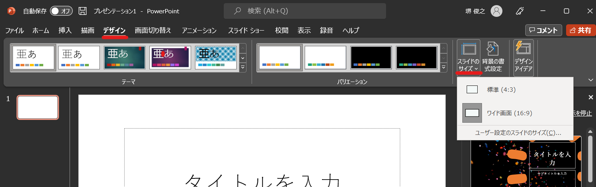

スライドを新たに作成する
----------------------------------------------
「ホーム」タブ →「新しいスライド」をクリックすると、新しいスライドが追加されます。

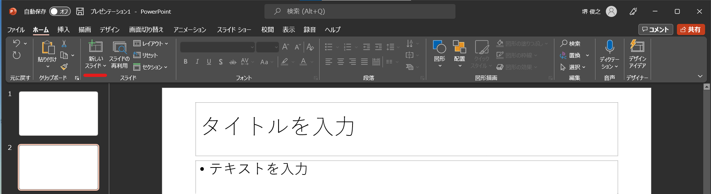

スライドの種類を選ぶ
-----------------------------------------------
「ホーム」タブ →「レイアウト」をクリックします。現在のスライドを、白紙や縦書き、２段組といった様々な種類に切り替えられます。無地のスライドを挿入したくなったときなどに便利です。

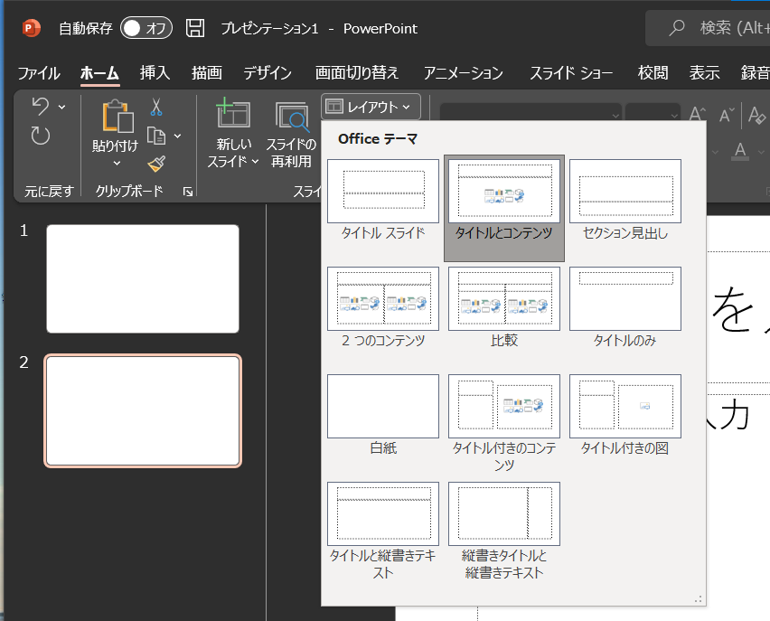

スライドを削除
-----------------------------------------
スライドタブ上で、削除したいスライドにマウスカーソルを合わせ「右クリック」→「削除」または削除したいスライドを選択し、Backspaceキーを押します。

スライドの順番変更
------------------------------------------
画面左のスライドサムネイル上でスライドを選択し、そのまま上下にドラッグします。複数選択後にまとめて移動させることもできます。

スライドの非表示
------------------------------------------
スライドショーを行う際に、指定のスライドを表示せずに飛ばして再生できます。画面左のスライド上で、非表示にしたいスライドで「右クリック」→「非表示スライドに設定」をクリックします。

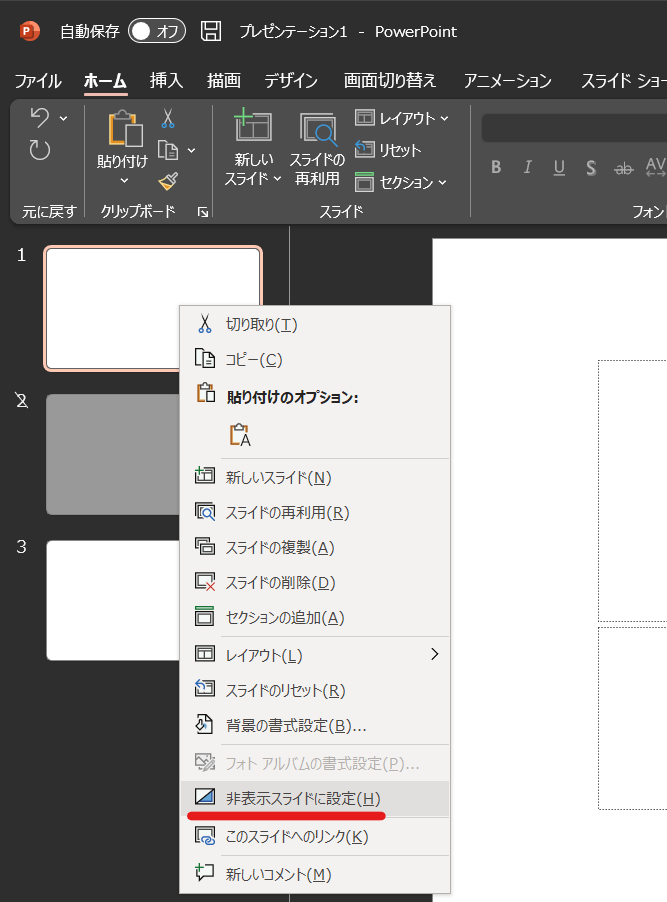

テキストの編集
-----------------------------------------
| 基本的にはWordと同じようにテキストを入力し、タブから編集する形になります。
| 新たな場所に文章を記入したい場合は、「テキストボックス」を挿入する必要があります。「挿入」→「テキストボックス」や図形にあるテキストボックスなどから作成できます。

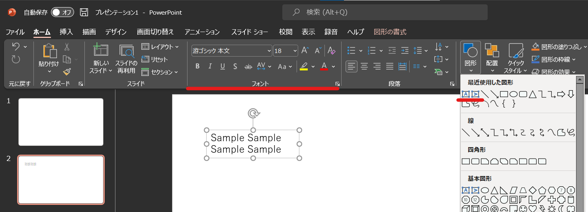

図形の描写
-----------------------------------------
| PowerPointでは線や図形の枠組みなどを挿入することで、様々な図形を作成することが出来ます。
| ホームタブ内の図形や挿入タブ内の図形から、作成したい図形を選ぶことでスライドに描写することが出来ます。

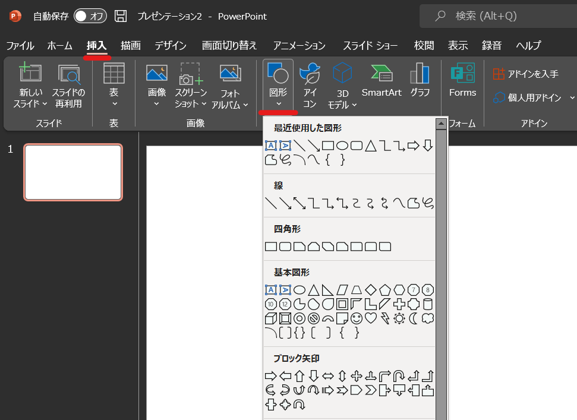

| また、スライドに描写した図形は、大きさや色を「図形の書式」タブから色々と編集することが出来ます。

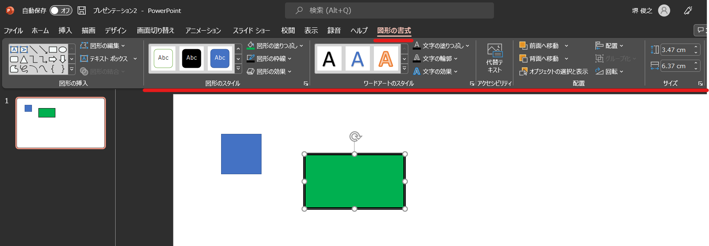

画像の編集
-----------------------------------------
| PowerPointでも他のソフト同様に画像を挿入することが可能です。更にPowerPointでは画像に対しグラフィック効果をかけられるなど、より機能が充実しています。

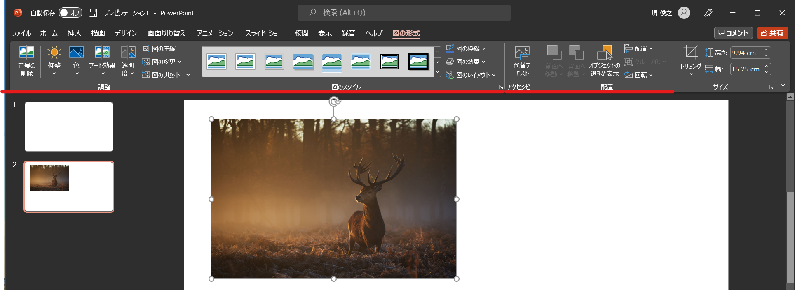

テーマの変更
^^^^^^^^^^^^^^^^^^^^^^^^^^^^^^^^
スライドのデザインを一括で変更することが出来るのが「テーマ」です。「デザイン」タブ →「テーマ」から好きなテーマを選択すると、全てのスライドのデザインが統一感のあるものに変わります。
テーマを変更すると、フォントやオブジェクトの見た目など、さまざまなものが変化し、色合いや図形の位置を整えるためなどに再調整が必要になる場合があります。テーマを使うのであれば早い段階で決めておくのが良いでしょう。

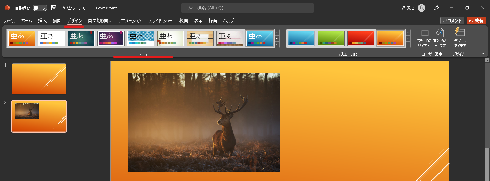

マスターの編集
^^^^^^^^^^^^^^^^^^^^^^^^^^^^^^^^
「テーマ」の内容(デザイン)自体を修正したい場合は、「スライドマスター」を編集すると良いでしょう。
「表示」→「スライドマスター」で画面を切り替え、編集します。
元々用意されているテーマはデザインの主張が強いものが多いので、「使うな」とまでは行かないですが、普段のプレゼンテーションでは、自分でスライドマスターを編集することで、シンプルな発表用のテーマを作成しておくと良いでしょう。

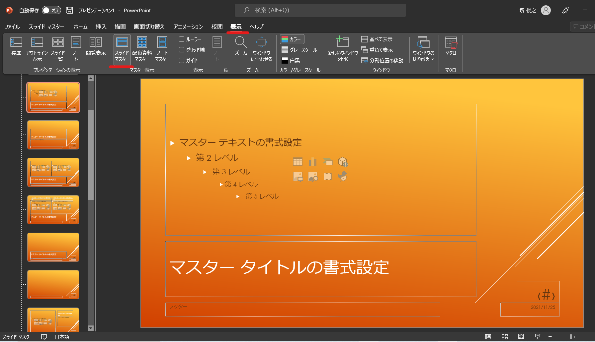

スライドショー
^^^^^^^^^^^^^^^^^^^^^^^^^^^^^^^^
スライドショーの実行
-------------------------------------------
作成したスライドは、「スライドショー」モードに切り替えれば、全画面表示の状態でスライドを再生できます。
実際に発表会などを行う場合は、主にこのスライドショーモードを使います。
「スライドショー」タブ →「最初から」または「現在のスライドから」を選択する、もしくは右下のスライドショーボタンを押すとスライドショーが開始されます。

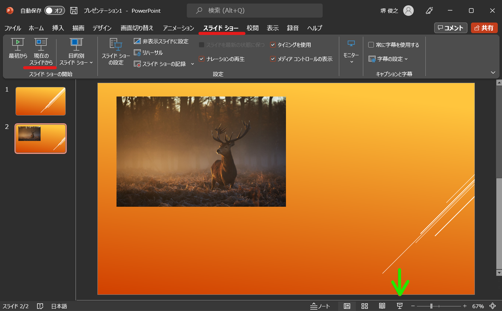

インク注釈
-------------------------------------
プレゼンテーション中に手書きのメモなどを書き込めます。「インク注釈」の機能を使用することで書き込めます。スライドショー実行中に画面上で「右クリック」→「ポインタオプション」→「ペン」を選択します。

スライド作成の際に気を付ける点
^^^^^^^^^^^^^^^^^^^^^^^^^^^^^^^^^^^^^
良いスライドを作成するにはいくつかコツの様なものがあります。また、作成に際して意識する点は、研究発表のためのスライドなのか、会議での発表・資料としても保存しておくためのスライドなのか、などの目的に応じて変化します。
ここでは、一般的な発表におけるスライド作成について気を付けた方が良い点を記述します。

短い文章で表現する
-------------------------------------
スライド上に入力する文章はあまり長くならないようにしましょう。
プレゼンテーションの場では、文章で表現するよりも、視覚的に分かりやすいスライドが良いとされています。
文字で説明する部分を出来るだけ減らし、必要な場所でのみ、キーワードを含む短い文章を箇条書き等を活用して書くのが一般的です。
スライドで載せきれない情報は、文字で書くのではなく口頭で説明することにになります。

話題を絞る
----------------------------
１枚のスライドに複数の話題を入れると見ている人の理解が追いつかず分かりにくくなります。
１枚のスライドで１つのキーとなるメッセージを説明する位の心構えが良いと思います。
別の話題をするときは、もう一枚別のスライドを作成してそちらで行うのがおすすめです。

視覚効果の活用
------------------------------------
図や写真を使い、出来る限り視覚的に理解しやすいスライドが良いと思います。

| プレゼンテーションに関しては、スライド作りもそうですが、話の構成や、スライドに載せる・載せない情報の選択など様々な点に気を付ける必要があります。
| 下記の資料は千葉大学の教科書資料ですが、よくまとまった有意義な情報だと思います。
| プレゼンテーションをする機会があれば是非一読してみて下さい。

https://www.gshpa.chiba-u.jp/content/files/textbook/textbook_presentation2017.pdf

スライド作成の演習課題
^^^^^^^^^^^^^^^^^^^^^^^^^^^^^^^^^^^^^^^^^^^^
| `[こちらの演習ファイル] <_static/documents/powerpoint/practice.pptx>`_ に、自分の出身地について, 好きなスポーツについて…等々何でも良いので１つテーマを決めて発表スライドを作成してみて下さい。
| スライド枚数はタイトル含めて最低3枚で、それ以上であれば何枚でも構いません。
| スライド作成の演習課題は、タイトルページに「氏名・所属」を記入してPandaの課題から提出して下さい。

スライドの構成は、たとえば以下のように作ると良いでしょう（あくまで一例ですが、ちゃんとした資料を作成する場合も、おおむねこのような構成になります。）

======================================== ======================================== ================================================================================
スライド                                  内容                                     詳細
======================================== ======================================== ================================================================================
1枚目                                     タイトルページ                            タイトル・学生番号・氏名など。
---------------------------------------- ---------------------------------------- --------------------------------------------------------------------------------
2枚目                                     簡単な内容や概要の説明                     発表内容の大まかな情報。発表内容の目次などが入ったりもします。
---------------------------------------- ---------------------------------------- --------------------------------------------------------------------------------
3枚目~                                    特徴や解説、具体例等                       主なコンテンツ。説明したい物の特徴やポイントを具体例や画像を交えて説明します。
---------------------------------------- ---------------------------------------- --------------------------------------------------------------------------------
X枚目(最後)                               まとめ                                    上記をふまえたまとめ・意見・感想など
======================================== ======================================== ================================================================================

皆さんの提出物も参考にしつつ、次回講義ではもう少し細かい操作方法やテクニックについて触れる予定です。
