==============================
 PowerPoint演習 2回目
==============================

| 1回目の講義では、基本中の基本の操作方法だけに触れました。今回はもう少し細かい・具体的な技術について触れていきます。

デザイン
^^^^^^^^^^^^^^^^^^^^^^^^^^^^^^^^^^^^^^^^^^^^

レイアウトなど
---------------------------------------------
| PowerPointの使い方から少し離れてしまうので紹介程度にとどめておきますが、図や文章の配置にはある程度デザインの定石の様なものがあったりします。以下のサイトなどを暇なときに見ておくと良いでしょう。
| [伝わるデザイン]: https://tsutawarudesign.com/ (未完成のページもあり)

ユニバーサルカラー
---------------------------------------------
| 配色は見た目を良くするという意味でも大切ですが、特に色盲の方に配慮するという意味で大切です。
| 学内の発表や、研究室内での発表では特に気をつける必要は無いとは思いますが、それなりに多くの人の前で行うプレゼンではユニバーサルカラーを意識しましょう。
| [色使いのガイドライン-国立遺伝学研究所]: https://www.nig.ac.jp/color/guideline_kanagawa.pdf

文章による情報伝達
^^^^^^^^^^^^^^^^^^^^^^^^^^^^^^^^^^^^^^^^^^^^

行間
---------------------------------------------
デフォルトの行間だとちょっと窮屈な印象を受けます。ホームタブの段落の所から変えることが出来ます。倍数で1.3くらいがおススメです。

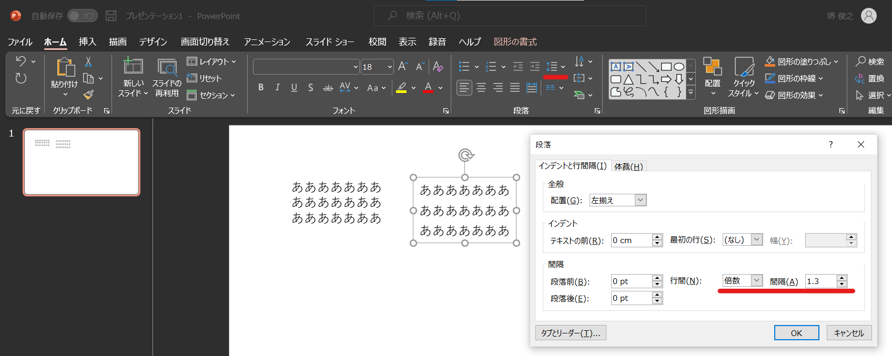

フォントについて
----------------------------------------------

| PowerPointでは文字を表現するのに様々なフォントを利用することが出来ます。
| スライドに利用するフォントは遠くからでもはっきりと見える様な物が好ましいです。
| また、フォントは英語・日本語でそれぞれ使えるフォントが異なります。(メイリオなどは日英両方あります。)

| 恐らく初期設定のままだと"MSゴシック"や"游ゴシック"になっていると思いますが、出来ればより見やすそうなフォントに変更してスライド作りを進めることをおすすめします。
| 太字(強調文字)にした際のメリハリなどもフォントによって大きく異なります。

.. note::
    フォントの種類に関してはMacの方が豊富なので、WindowsとMacで選べる種類が異なります。自分でもいろいろ試して良さそうなフォントを見つけておきましょう。

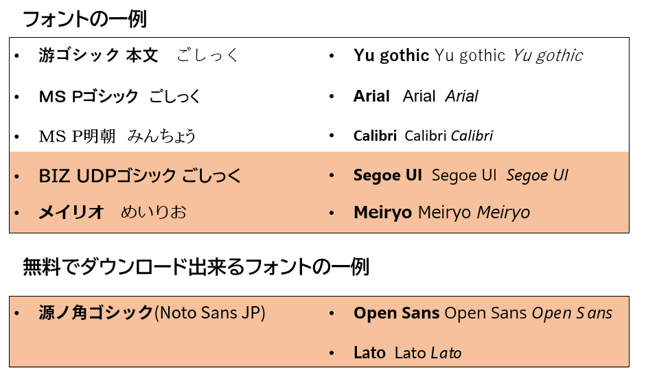

| また、WindowsやMacに標準搭載されているフォントだけではなく、Google Fontsから新たなフォントをダウンロードして使うことも可能です。
| Noto Sans JP(源ノ角ゴシック)や英字フォントのLatoなどはGoogle Fontsから利用できます。(無料です。)サイトからダウンロードしてきてファイルを解凍し、インストールすると利用できます。
| 有料のものだとモリサワUD書体などが有名。

.. note::
    | インストールしたフォントやMacにしかないフォントは綺麗なものが多いですが、他者と共有する場合などに、他のPCでは読み込めない場合があります。
    | 共有する可能性があるスライドでは一般的なフォントを使うようにしましょう。

* Google Fonts

| Noto Sans JP(源ノ角ゴシック) https://fonts.google.com/noto/specimen/Noto+Sans+JP
| Lato https://fonts.google.com/specimen/Lato?query=lato#standard-styles

* おすすめのフォント例

======================================== ======================================== ================================================================================
OS                                       言語                                      フォント
======================================== ======================================== ================================================================================
Windows                                   日本語                                    メイリオ、Noto Sans JP、BIZ UDPゴシックなど
---------------------------------------- ---------------------------------------- --------------------------------------------------------------------------------
Windows                                   英語                                      メイリオ、Segoe UI、Latoなど
---------------------------------------- ---------------------------------------- --------------------------------------------------------------------------------
Mac                                       日本語                                    ヒラギノ角ゴシック、メイリオ
---------------------------------------- ---------------------------------------- --------------------------------------------------------------------------------
Mac                                       英語                                      Helvetica、Avenir Nextなど
======================================== ======================================== ================================================================================

スライドに文字・文章を載せる
----------------------------------------------

| 特にスライドでは、1枚当たりの発表時間が限られているので、文字の多い文章をひたすら書くのではなく、箇条書きを活用したり、着目すべき部分とその補足情報を切り分けるのが文字による情報伝達のコツです。

| **本文と補足情報の切り分け**
| 箇条書きでは可能な限りシンプルに伝えたいメッセージを文字として載せておき、補足情報は枠などを使ってまとまりが分かるように載せると良いことが多いです。

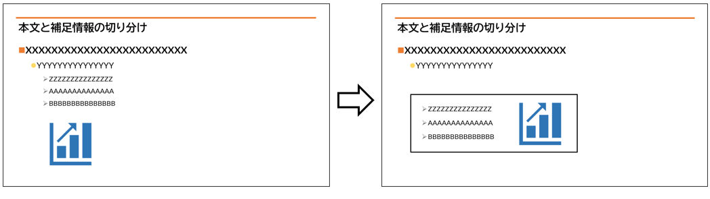

| **まとまりに枠を付け、まとまり同士を矢印でつなぐ。**
| 箇条書きを多用したり、箇条書きの間の関係性を矢印などでつなごうとすると、どの部分の関係性を示しているか分かりにくくなります。
| これも枠を利用してまとまりをつけると見やすくなる場合があります。

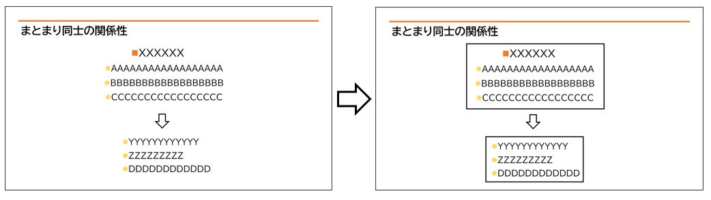

| **視線誘導**
| 1枚のスライドの中に多くの情報が載っている場合、色をつけた枠組みなどを活用して、着目させるポイントを分かりやすくすると良い事が多いです。

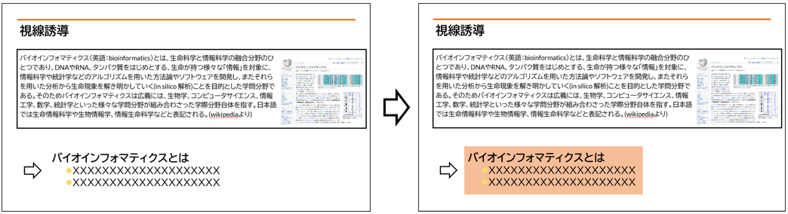

| **スマートアート**
| PowerPointにはSmartArtという機能があり、複数の関係する情報を表示する方法を提示してくれます。
| ただ、SmartArtはカスタマイズや文字の大きさ・幅などを調整するのが難しかったりするので使用はあまりおススメできません。

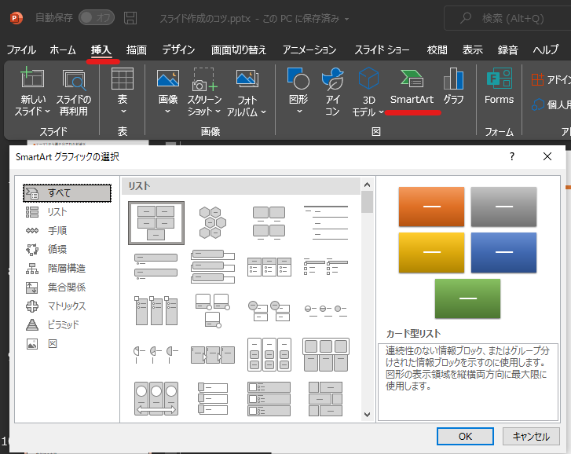

文章は少しずつ伝える
----------------------------------------------

| スライドの作成というより発表する際の工夫の様なものですが、人間は一気に大量の文字を読むことは出来ません(速読など特殊な訓練を積んだ人もいるとは思いますが)。
| よって、文字情報は理解できそうなペースで少しずつ小出しにしていくというのが聞き手の理解を助けることになります。
| その際に以下の様な工夫の仕方があります。

| **目次スライド**
| 目次スライド等項目を順番に説明していくようなスライドでは、説明している部分を強調する様に複数のスライドに分けて用意しておくという方法があります。

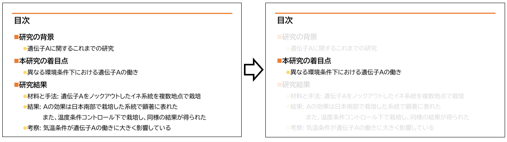

| **長文を説明するとき**
| 基本的にスライドで長文を表示するのはあまりよくありませんが、どうしても載せておきたい時には、説明する部分の文字色を変えていくことで説明している部分を分かりやすくすることも出来ます。

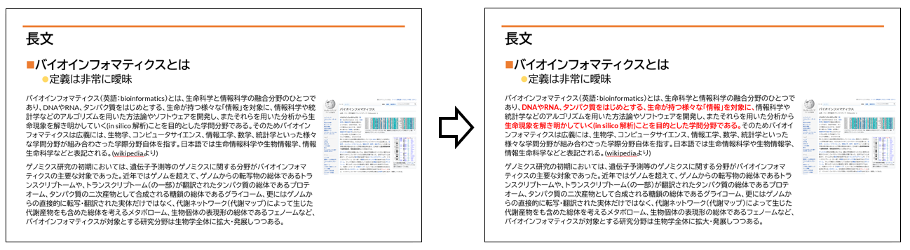

図形の作成や編集のコツ
^^^^^^^^^^^^^^^^^^^^^^^^^^^^^^^^^^^^^^^^^^^^

| WordやExcelともっとも異なる操作としてはこの図形や画像を作成したり編集するところになります。
| 皆さんが今後どのような勉強・研究を進めて行き、どの様な発表をすることになるかによってもよく使用する図形は異なってくるとは思いますので、代表的な操作方法を一通り紹介します。

フリーフォームと曲線ツールで大体何でも書ける
--------------------------------------------------------------------------------------------

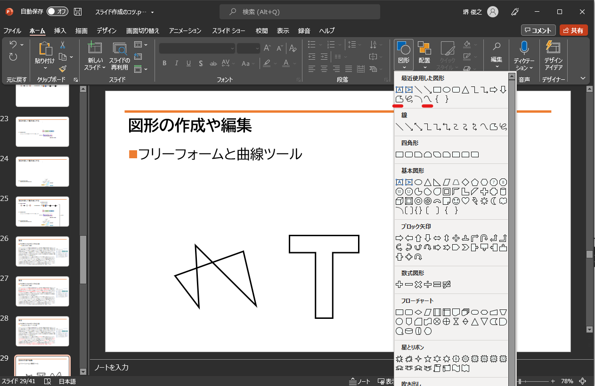

重なり合ったオブジェクトの並び替え
----------------------------------------------

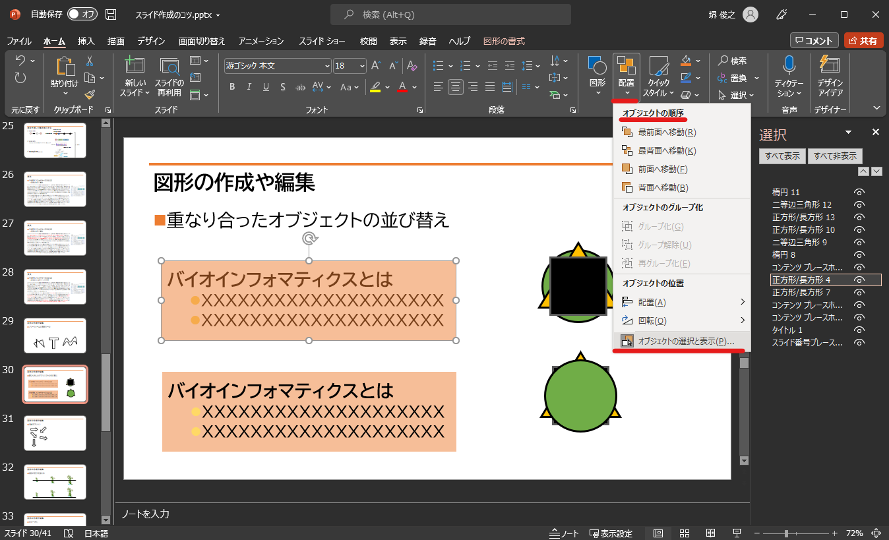

回転オプション
----------------------------------------------

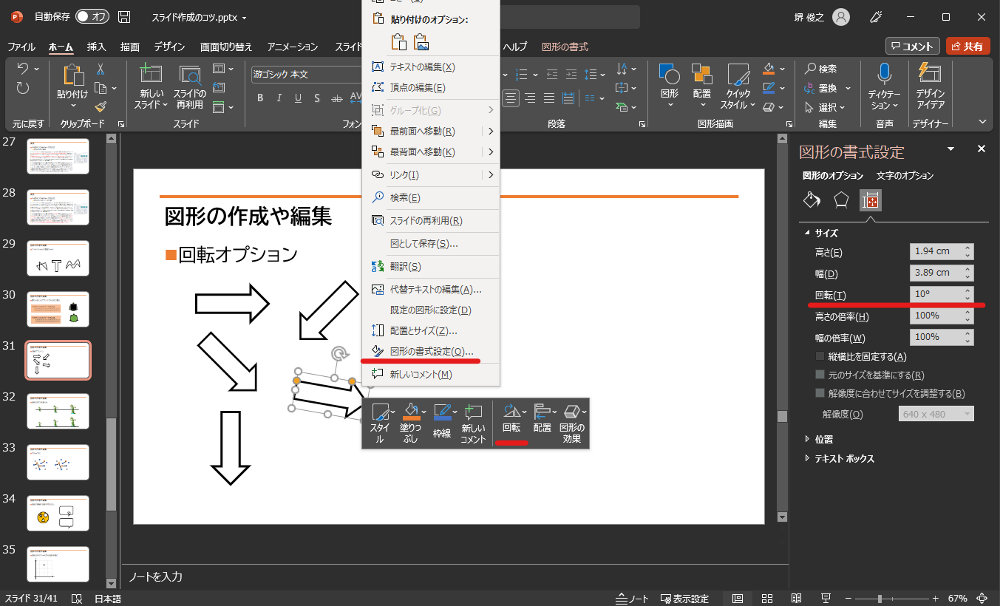

図形の並びを揃える
----------------------------------------------

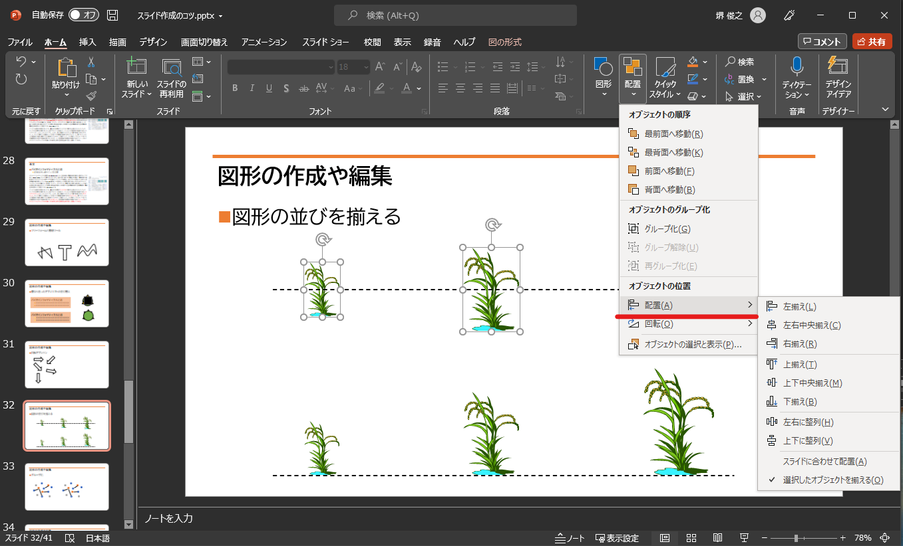

グループ化
----------------------------------------------

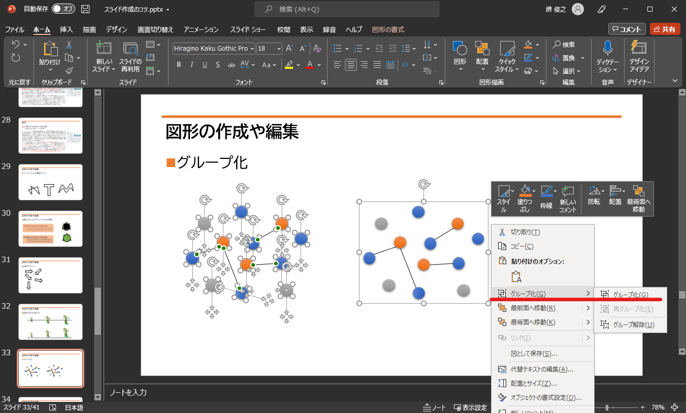

図形の接続と図形の切り出し
----------------------------------------------

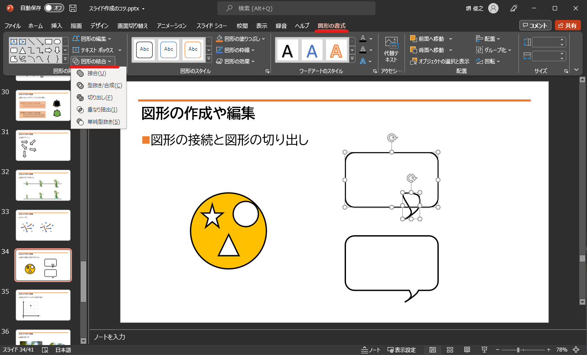

図形以外のツールから図形を描く
----------------------------------------------

(例)表を活用してxy軸のグラフを描く

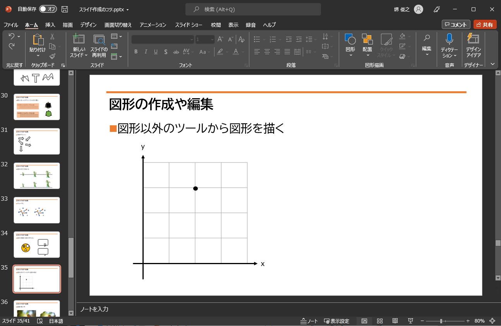

画像を上手く使う
----------------------------------------------

| **著作権の問題**
| デザインを変えたり、スライドに視覚的な効果を与えるときに画像を使うことがあるかもしれません。
| しかし、イラストや写真などを利用するときには著作権法に従う必要があります。また、写真などに写っている人については、人の「肖像権」を保護することが求められます。公の場に出るようなスライドには、フリー素材を使用するようにしましょう。

.. note::
    著作権に関しては、京都大学の情報基礎演習の教科書の7章を参照

| **画像の利用に関して**
| 2021年12月の時点でフリー素材の画像を配布しているサイトをいくつか載せておきます。

* PowerPointの「画像」(挿入タブ→画像→ストック画像など)
* Unsplash https://unsplash.com/
* Burst https://burst.shopify.com/
* Pexels https://www.pexels.com/ja-jp/
* ぱくたそ https://www.pakutaso.com/

| 画像をスライド上で利用するときには文字との併用に注意する必要があります。

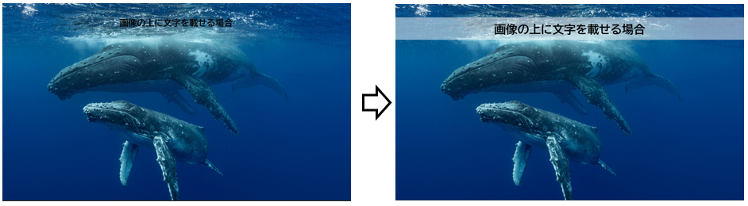

| また、画像を任意のサイズに編集する方法としてトリミングがありますが、図形に合わせてトリミングしたり、また逆に図形を画像で塗りつぶしたりすることも出来ます。

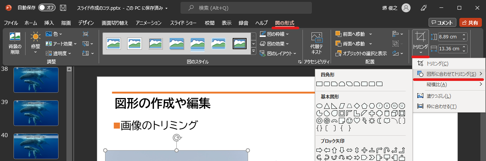

| **イラストの利用に関して**
| 写真よりイラストの方が拡大や加工がしやすいので、プレゼンテーションやスライドではよく利用するかもしれません。
| イラストも画像と同様著作権を意識する必要があるので、フリー素材を利用するようにしましょう。

* PowerPointの「アイコン」(挿入タブ→アイコン)
* いらすとや https://www.irasutoya.com/ (検索にコツがいる気がします)
* Emojipedia https://emojipedia.org/ (文字なのでフリー素材)

| イラストは画像とは違って、色の編集や加工がしやすいです。
| またイラストを図形として扱うことで、パーツに分解出来たり画像の接合・切り出し処理が行えるようになります。

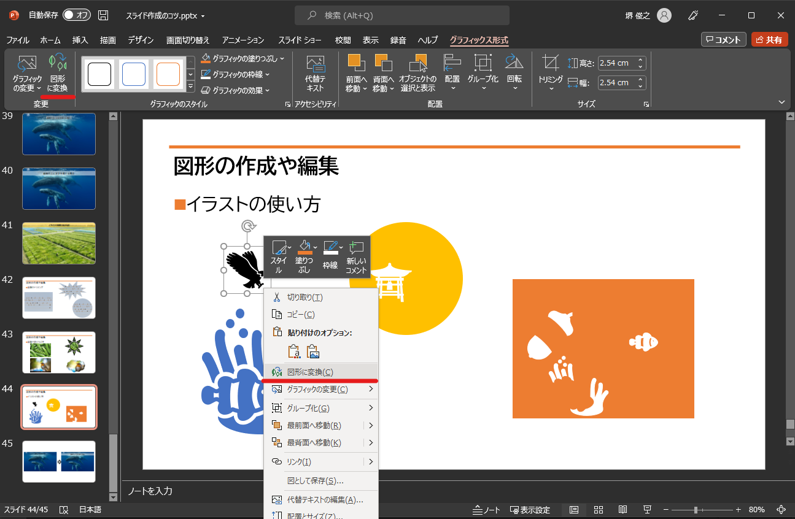

図形の作成や編集の練習問題
^^^^^^^^^^^^^^^^^^^^^^^^^^^^^^^^^^^^^^^^^^^^
`[こちらの練習ファイル1] <_static/documents/powerpoint/practice2.pptx>`_ (または自分のPowerPoint)を開いて、以下の図形をつくってみましょう。

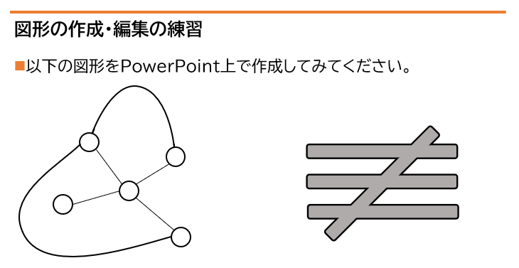

テンプレートの作成
^^^^^^^^^^^^^^^^^^^^^^^^^^^^^^^^^^^^^^^^^^^^
| スライドマスターからテンプレートを作成しておくことで、フォントや段落のフォーマット、図形の初期設定などをしておくことが出来ます。
| 作成したテンプレートを保存しておくことで、フォントやフォーマットの設定を毎回任意のものから始めることが出来ます。
| テンプレートの保存は、名前を付けて保存→保存形式を「PowerPointテンプレート(.potx)」として保存しておく形になります。

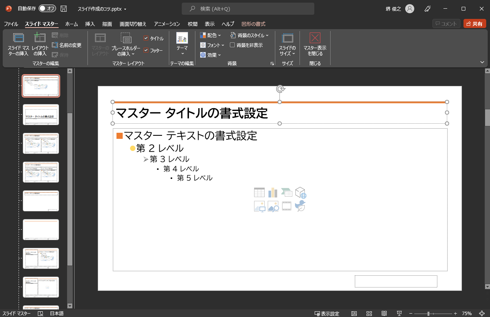

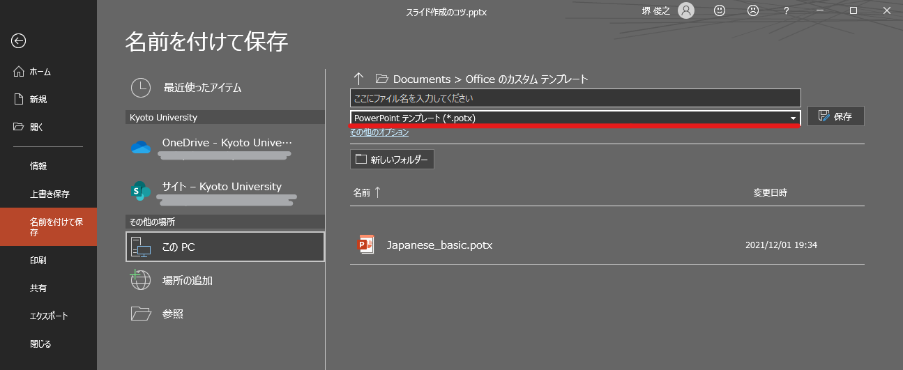

図形の初期設定(線の色や太さ、塗りつぶしなど)を変えるには、テンプレート上で任意の図形を「既定の図形に設定」しておくことで、図形の初期設定を任意のものに変更できます。

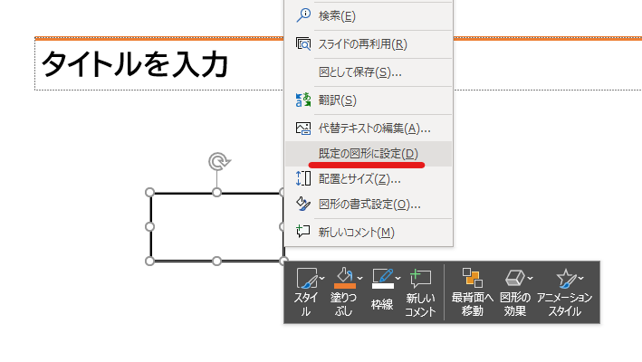

.. note::
    日本語テンプレート・英語テンプレート・発表用・論文紹介用など良く使う目的に応じて幾つか作っておくと便利です。

Word・Excel・PowerPointの連携
^^^^^^^^^^^^^^^^^^^^^^^^^^^^^^^^^^^^^^^^^^^^

Word・Excel・PowerPointのソフト間で表やグラフ、スライド画像などをオブジェクトとしてコピーし、貼り付けることが出来ます。

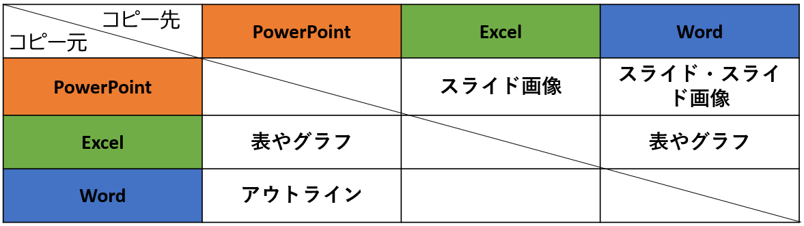

Excelの表を貼り付ける
----------------------------------------------
| 例えばExcelで作成した表をWordに貼り付ける場合、通常の「貼り付け」と「リンク貼り付け」という方法があります。
| 通常の貼り付けではWord文書内の表として扱うことになり、リンク貼り付けでは貼り付け元と貼り付け先のデータが連携されるので元の表を更新すると貼り付けた先の表も更新されます。

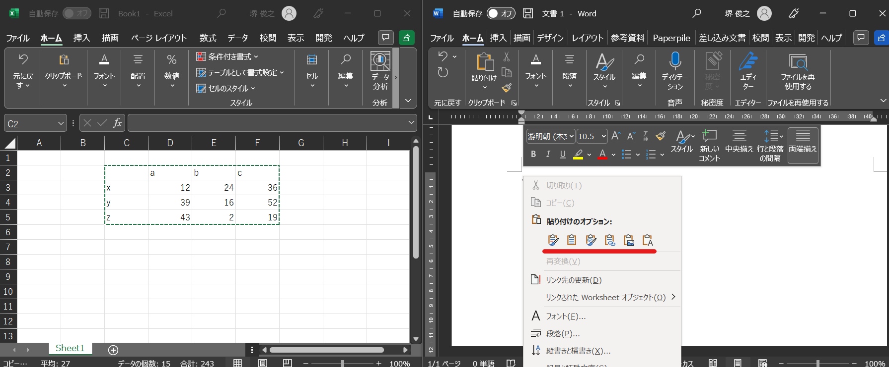

PowerPointスライドを配布資料としてWordに貼り付ける
--------------------------------------------------------------------------------------------
| PowerPointで作成したスライドを、Wordでまとめて配布資料として扱うことも出来ます。
| ファイル→エクスポート→配布資料の作成からスライドをWordファイルに載せることが出来ます。

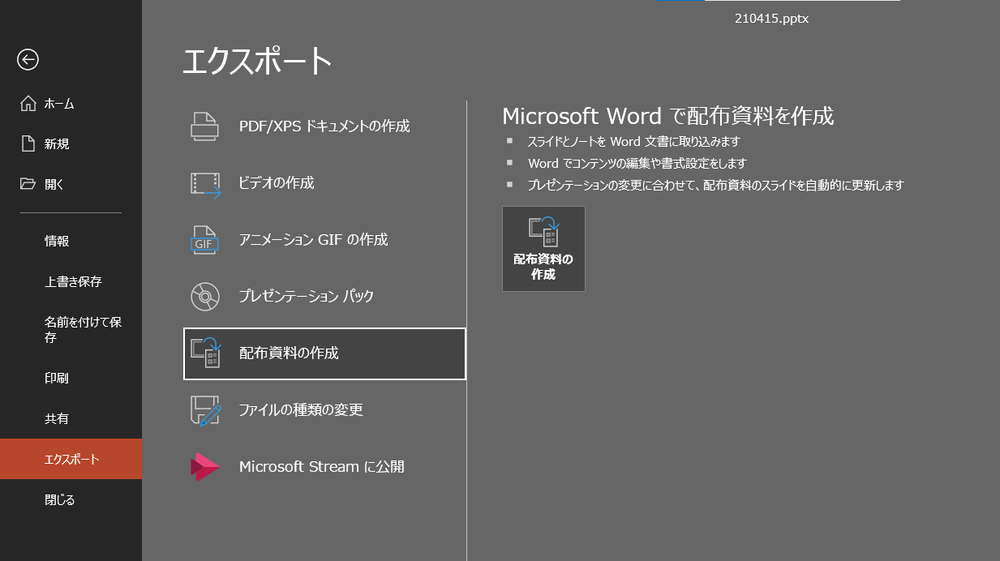

プレゼンテーションのTips
^^^^^^^^^^^^^^^^^^^^^^^^^^^^^^^^^^^^^^^^^^^^

**主役をはっきりさせる**
----------------------------------------------

| スライドを作成する際には、プレゼンテーションで何を達成したいのかを意識することが大変大事になってきます。自分という人間に興味をもって貰うことなのか、プレゼンした商品を買ってもらうことなのか、自分の知識を聴衆に伝達したいのか、などですね。
| その際にプレゼンテーションにおける主役が誰なのかを意識することが大事です。
| 例えば、何か自分の知見を伝達するための講演を行った際に、「自己紹介や雑談が面白かった」という感想が来るようでは、肝心の目的の話よりも雑談が主役になってしまっているのでプレゼンとしては失敗と言えます。
| 逆に、学会発表などでは、研究内容も当然伝える必要はありますが、「"誰が"どんな研究をしているか」を売り込む場でもあるので、自分自身のPRもしっかりやる必要があります。
| つまり、良いプレゼンテーションとは **「誰が誰に何を売り込みたいのか」** がはっきりしているプレゼンテーションになります。

**(基本的には)会場の全員が理解できるスライド作りを目指す**
--------------------------------------------------------------------------------------------

| テストでは100点を取る必要はありませんが、プレゼンテーションは100人中100人に正しく伝わるスライドを作るべきだと思います。※人によってここの考え方は違うかもしれません。
| 例えば授業だと、受講生の平均くらいのレベルをターゲットに授業内容を決めます。一番下に合わせて授業をしていては進み方等に影響が出てしまうので、進度などを考えると100人中80人くらいが理解できる内容で、残りの人には個別にサポートなどをする形式がバランス的に良い形です。
| しかし、(目的にもよりますが、)発表に関しては、その場にいる全員誰もが正しく理解できるスライドを作ることを目指すべきだと思います。
| 「このくらいはご存知だと思うので割愛します」の様な発表をされる方もいますが、非常に傲慢かつ雑な発表では無いかと思います。
| 特に研究の発表に関しては、その研究をしているのは日本で自分だけ、の様な状況も普通にあり得るので、聴衆の前提知識によらず(教授や研究者といっても自分の専門分野以外の知識は皆さんとそんなに変わらないと思っていて良いです)理解できるスライドやプレゼンテーションの準備を心がけましょう。

**スライドは発表用スライドだけでなく、補足資料などのサブスライドも用意しておく**
--------------------------------------------------------------------------------------------

| まだ皆さんには早い話かもしれませんが、研究発表の場では15分発表5分質疑応答などの時間が設定されていることが多いです。
| 5分で質問に次々と答えていくのはなかなか難しかったりするので、その際に補助となる資料などをメインのスライドの後に用意しておくことが多いです。
| また、この様にメインと補足資料という風に分けることを前提でスライドを作成することで、発表用のメインスライドがすっきりするという利点があります。
| 発表用スライドのみを作ろうとしてしまうと、必要な情報だけでなく、それほど優先度の高くない情報も「一応入れておくか…」と入れてしまったりして、ごちゃごちゃとしたスライドになってしまう事が多いです。
| 初めからメインとサブに分けておくことで、必要な情報のみをメインのスライドに載せ、残りはサブに回しておくという形ですっきりさせることが出来ます。(あとは発表時間等に応じて調整する。)

