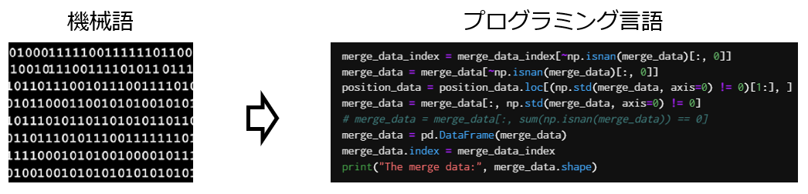
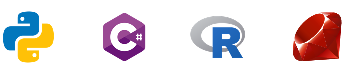

=============================
 プログラミングについて
=============================

コンピュータの構成と動作
^^^^^^^^^^^^^^^^^^^^^^^^^^^^^^^^^^^^^^^^^^^^^^^^^^^^^^^^^^^^^
本講義の最初の方で、コンピュータはメモリ上に呼び出したデータやプログラムをもとにCPUが命令を処理していく、という様な話をしました。
この時、CPUなどのハードウェアが実行出来る命令は、高速で処理するために極めて単純な命令群として構成され、「機械語」と呼ばれます。

プログラミング言語
^^^^^^^^^^^^^^^^^^^^^^^^^^^^^^^^^^^^^^
機械語を人間が解読するのは非常に難解なので、この問題を解決するために「プログラミング言語」が考案されました。
機械語よりも数式など人間に理解しやすいプログラムを書くためのルールに沿って記述できるようにしたものです。
こうしてルールに沿って書かれたプログラム(ソースコード)を、ソースコードを実行するプログラムによって処理し、実行するという形になります。

プログラミング言語の種類
^^^^^^^^^^^^^^^^^^^^^^^^^^^^^^^^^^^^^^^^^^^^^^^^^
| プログラミング言語にはいくつも種類があり、様々なプログラミング言語が開発され、利用されています。
| (例) FORTRAN, C, C++, C#, COBOL, Java, Go, Swift, Perl, Ruby, PHP, Python, LISP, Julia, Javascript, R...etc

| また、プログラミング言語に似たものとしては、Webページの構成を決めるHTMLやページのスタイルを決めるCSS、データベースへのアクセスを記述するSQLなども併用されます。

| コンピュータの技術の進展に伴って，開発するプログラムも高度化されていき．そういったプログラムを効果的に記述するために新たなプログラミング言語が開発されてきました．
| また，より簡単に書ける様にだったり、より高速に、安全に動かしたいとった特定の用途に適したプログラミング言語が開発されることもあります。
| こうした事情から、新しいプログラミング言語が開発されたり、プログラミング言語の仕様や処理系が改訂され続けています。

| では新しい言語が何でも良いのかというと、そうとは限らず、特定のプログラミング言語で開発されたソフトウェア資産の活用や維持など、古いプログラミング言語の継続が求められることもあります。
| 例えばFORTRANと呼ばれる科学計算用のプログラミング言語は、言語としては最も古いものの１つですが、計算速度最速の言語の１つでもあるため、さまざまな改訂が行われつつ現在も研究や開発に使用されています。

プログラミング言語の処理系
^^^^^^^^^^^^^^^^^^^^^^^^^^^^^^^^^^^^^^^^^^^^^^^^^^^
プログラミング言語で書かれたソースコードを実行するためのプログラム(処理系)にはいくつか種類があります。

**1. コンパイラ方式**

| ソースコードを一旦機械語に翻訳(コンパイル)し、翻訳された機械語を実行する方式です。
| 最初のコンパイルに手間がかかりますが、一旦コンパイルしてしまったプログラム(機械語のプログラム)は高速に実行が可能です．
| C, C++，FORTRAN，COBOLなどが代表的なコンパイル型言語です。

デメリットとしては、コンパイルする手間がかかることや、コンパイルしたプログラムは他の環境(OSやCPUが異なると)実行できないことなどです。

**2. インタープリタ方式**

| ソースコードを逐行的に解釈していく方式です。
| ソースコードの解釈を毎回行うため実行速度は遅くなりますが、作成したソースプログラムをただちに実行でき、柔軟性が高い処理系を構成できます。
| PythonやPerlなどが代表的なインタープリタ方式です。

解釈しながら実行されるため、コンパイル型に比べると実行速度が遅いというのが欠点です。特にプログラム中の何度も実行されるような部分では、かなり大きな無駄が生じます。

プログラミング言語の用途
^^^^^^^^^^^^^^^^^^^^^^^^^^^^^^^^^^^^^^^^^^^^^^^^^^^
コンピュータ上で動くプログラムは、科学計算や数値シミュレーション、文字列・画像などのデータの加工・分析、ゲームやグラフィクスの作品創作、Webアプリケーションの開発など、多岐にわたります。

| あくまでも一例ですが主な用途を表にして載せておきます。
| ただし、載っている用途以外に使えないかというとそうではなく、どの言語でもやろうと思えば大抵のことは可能です。
| 例えばデータ解析に使用されることが多いPythonですが、Web開発に使用している場合もたくさんあります。

==================================== ==================================================== 
 用途                                 言語                                  
==================================== ==================================================== 
スマホアプリ                           iOS...Swift, Objective-C Android...Java, Kotlin
------------------------------------ ----------------------------------------------------
ゲーム開発                             C, C#       
------------------------------------ ----------------------------------------------------
Web開発                               PHP, Ruby, Javascript, (HTML, CSS)   
------------------------------------ ----------------------------------------------------
データ解析・機械学習                    R, Python, Julia
------------------------------------ ----------------------------------------------------
組込みシステム(家電など)                C, Java
==================================== ====================================================

プログラミングの勉強の仕方
^^^^^^^^^^^^^^^^^^^^^^^^^^^^^^^^^^^^^^^^^^^^^^^^^

**1. 興味のあるものに取り組む**

| 「iOSアプリを作ってみたい」「ゲームを作ってみたい」「Webアプリケーションを作ってみたい」「機械学習をやってみたい」など、目標や目的があるとプログラミングの上達は確実に早くなります。
| もちろん、いきなりNintendo Switchのゲームを作ったりすることは出来ないですが、勉強を進める過程で、作ることが出来るプログラムが確実に目標に近付いていくことが実感できると思います。
| 漠然と「プログラミングをやってみたい」といった形だと、ある意味プログラミングの世界は終わりが無いのでモチベーションの維持が難しくなるかもしれません。

**2. とにかく書く**

| プログラミングを習得するには「自分でコードを書く」という作業が最も大切になります。
| プログラミングを勉強するための様々なWebサイトや書籍が出ていますが、そういったものを眺めたり読んでいるだけではあまり上達は見込めません。
| 書籍に載っているコードを写経したり、一部分を自分で変えてみたりと自分で書いて動かしてみることで、プログラミングは上達します。
| コードの内容を理解してから動かしてみる、ではなくて、実際に動かして色々いじってみる過程でコードの内容を理解していくという感じがおすすめです。

**3. エラーに対処する**

| プログラムを書いていると、ほぼ間違いなくエラーが発生します。その様なときに、何故エラーが発生したのかを考えたり、どうすれば解決できるのか調べることで経験値が高まります。
| 基本的にエラーメッセージをちゃんと理解できれば解決出来るものが多いのでエラーメッセージに慣れることが大事です。

| 流れとしては、本講義で扱う様な、どのプログラミング言語でもある程度共通の知識を勉強した後は、興味のあるものを実際に作っていくのが良いと思います。
| 例えばiOSアプリを作りたい場合、最初は書籍などに載ってるサンプルアプリを書籍通りに自分のコンピュータで作ってみる。その後は作ったアプリに少しだけ機能を加えたものを作ってみる。そうして実装できる機能を少しずつ増やしていくという形です。
| 大切なのは、実際に手元でコードを書いて計算を実行したり、プログラムを作ってみることになります。

Rについて
^^^^^^^^^^^^^^^^^^^^^^^^
| 「R」は統計解析用のプログラミング言語です。
| 様々な統計分析(回帰や分散分析etc)やグラフの作成などを行うことが出来ます。
| 機械学習やデータ解析はPythonでやるものと思っている方もいますが、それらは殆どRでも出来ます。
| また、Rは統計処理でやデータ解析に活用されることが多いですが、グラフィックス機能も強力です。複雑なグラフや地図、3D図など様々な図を作成することが出来ます。

本講義ではRを使ってプログラミングの基礎を学びます。

通常はRを自分のパソコンにインストールして利用する形になりますが、皆さん所持しているパソコンやOSも様々なので今回はGoogle ColaboraotryというWebサービスで演習を行います。

R: https://www.r-project.org/
