===================
 Word演習 1回目
===================

本講義では、ドキュメント作成ソフトのWordの基本的な使い方について学んでいきます。

.. note::
    レポート作成や卒業論文、セミナー配布資料の作成などで主に使用することになり、大学生にとっては使用頻度の多いソフトになります。

ページレイアウトの設定
^^^^^^^^^^^^^^^^^^^^^^^^^^^^^^^^^^^^^^^^^^^
| 作成する文書全体のレイアウトを設定します。
| 出席レポートや簡単な資料であればデフォルト(初期設定)のままで問題無いですが、レイアウトを指定されたレポートや論文を書く場合、適切に適宜変更していく必要があります。

以下の項目を主に設定することになります。

| **用紙サイズ**
| A4やB5やB4などの用紙サイズを作成できます。あくまで電子データ上のサイズです。 
| 実際に印刷する際には、A4で作成した文書を縮小してB5サイズの紙にすることもできます。
| (この場合、「印刷設定」で設定することになります。)

| **用紙の向き**
| 縦向きか横向きかを設定できます。

| **余白**
| 左右上下をそれぞれ独自の幅で設定できます。

| **文字数**
| 文書の横に何文字入れるかを設定します。フォントの大きさとも連動します。

| **行数**
| 文書の縦に何行入れるかを設定します。フォントの大きさやフォントの書式とも連動します。

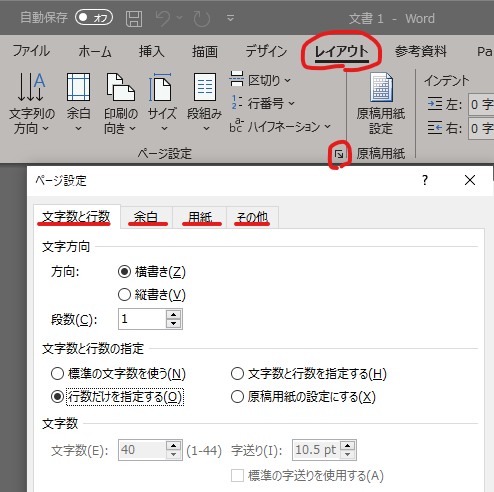

.. note::
    | LibreOfficeの場合、「書式」→「ページスタイル」から設定できます。 
    | (注意)LibreOfficeでは、行数と文字数の設定の仕方はWordとは少し異なります。 

段落のレイアウト
^^^^^^^^^^^^^^^^^^^^^^^^^^^^^^^
| 段落内の文字のレイアウトを変更します。
| タイトル位置・日付・氏名の項目の位置調整に利用することが多いです。

| **段落内の文字レイアウトを指定するツールバー**
| 左揃え、中央揃え、右揃え、両端揃え（各行の左右の端がそろうように調節）、均等割付け（各行の両端がページ端にそろうように文字間の空白が調節される）と設定できます。
| 段落間のより細かい指定は段落の詳細設定ダイアログを開いて指定しましょう。ツールバー右下の矢印か、文章を選択して右クリック→段落から。

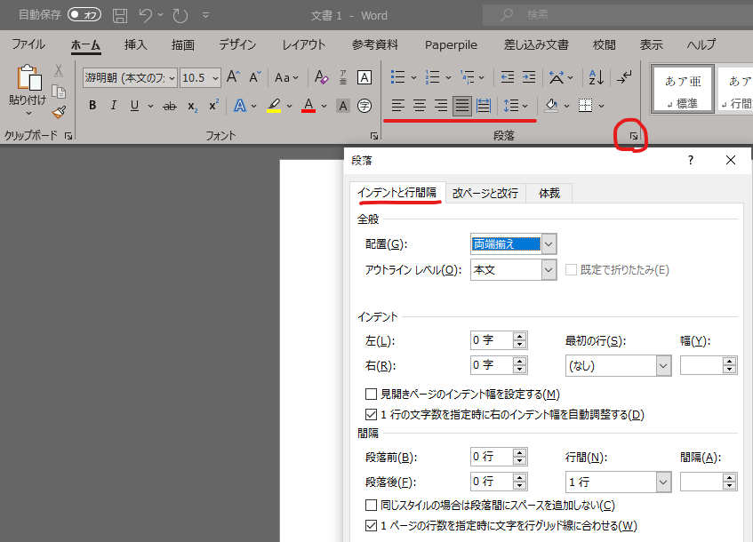

| **「段落番号」** を使用すると、 段落の先頭に「1. 2. 3.」などの番号をつけることができます。
| 段落番号を付けたい段落にカーソルを合わせるか、段落番号を付けたい範囲をドラッグで選択します。「段落」内にある段落番号を選択します。数字以外の段落番号を付けたい場合は、番号ライブラリから表示したいものを選択します。

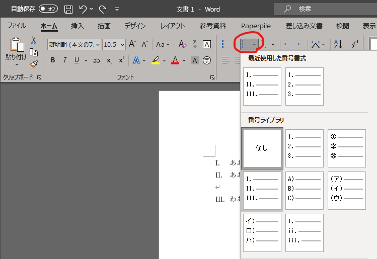

.. note::
    | 改行について
    | Word では **「改行」と「改段落」** という2つの方法があります。 
    | 段落番号を設定した場合、 「改段落」を行えば新しい番号が付与されて、新しい段落が始まることになりますが、 「改行」を行えば同じ番号内で行が改められることになります。
    | **「Enter」** だけを押した場合には **「改段落」** になり、
    | **「Shift + Enter」** を押すと **「改行」** になります。 

同じような機能として、 **「箇条書き」** を使用すると、 段落の先頭に「●」などの文字を行頭につけることができます。
段落番号の時と同様に、段落記号を付けたい段落にカーソルを合わせるか、段落番号を付けたい範囲をドラッグで選択します。「段落」内にある 箇条書きから、表示したいものを選択します。

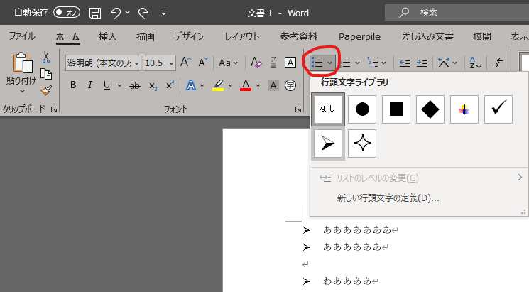

ルーラー
^^^^^^^^^^^^^^^^^^^^^^^^^^^^
がんばって調べる

文字の装飾
^^^^^^^^^^^^^^^^^
| **フォントを指定するツールバー**
| フォントの種類、大きさ、文字飾り(太字、斜体、下線など)を変更することが出来ます。 
| より細かい指定はフォントの詳細設定ダイアログを開いて指定します。

| フォントなどを変更したい文字列をドラッグして選択します(選択された部分が白黒反転した状態)。この状態で、ツールバーのボタンを押して文字の種類や装飾、大きさなどを変更します。選択した状態で右クリック→フォントからも変更できます。

.. figure:: _static/images/font.png

.. note::
    LibreOfficeの場合も、アイコンは異なりますが、段落のレイアウト・文字の装飾共に同じような操作を行うことができます。

その他の機能
^^^^^^^^^^^^^^^^^^^^^^^^^^^^^^^^^^^^^^^^^^^^^^^^^^^^^^^
| **文字数と行数のカウント**
| 「文字カウント」を使用することで、 文書全体の文字数や行数などを確認することができます。
| 文字数制限のあるレポートや論文などを書く際には、 頻繁に使用する機能になるかと思います。
| 「校閲」タブの中の「文章校正」グループにある「文字カウント」をクリックするか、左下のXX(単語数)単語という部分をクリックします。
| そうすると、文字カウントダイアログボックスが立ち上がります。

| 単語数というのは主に英単語の数をカウントしてくれます。英語論文(論文は基本的に英語で書きます)を執筆する際に頻繁に利用します。

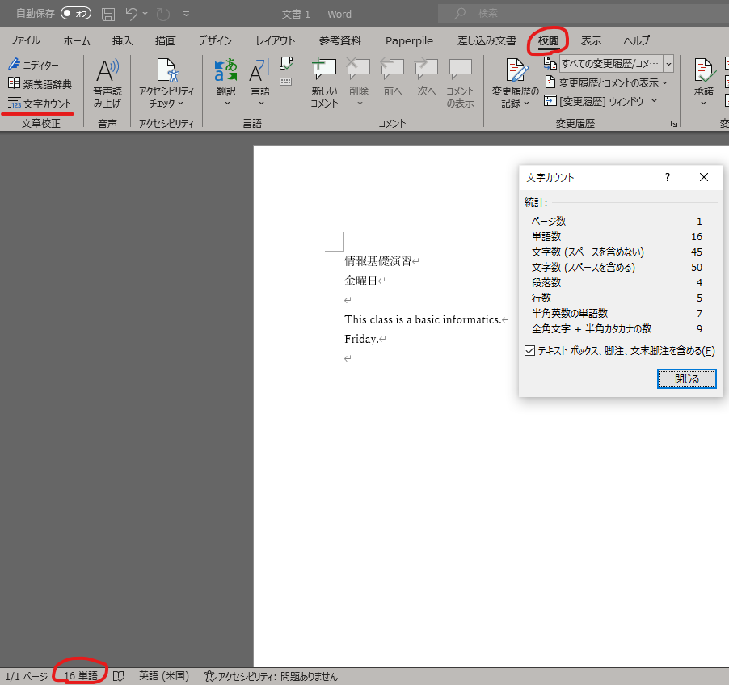

図表の挿入
^^^^^^^^^^^^^^^^^
表の挿入
---------------------------
| 表を作成するには、「挿入」タブの「表」を使用します。
| 行数・列数を指定することで、文章中のカーソル位置の場所に表が挿入されます。
| 更に大きい表を入れたければメニューの「表の挿入」を利用します。

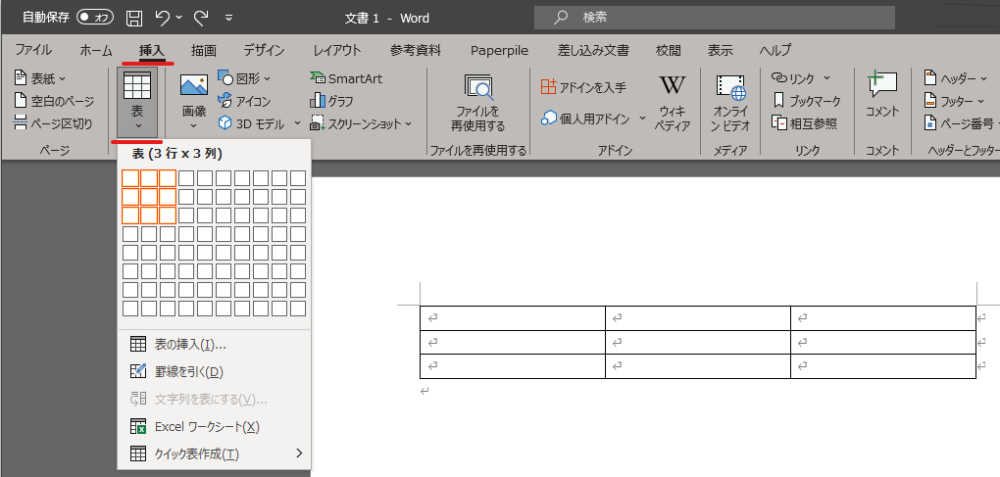

| 表全体のサイズを変更するには右下の四角部分をドラッグし、表の位置は左上のマークをドラッグすることで移動できます。

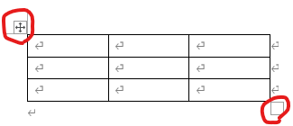

| 罫線をドラッグすると、セルのサイズを変更できます。ダブルクリックすると入力された文字の大きさに調整されます。また、表全体を選択したのち、何れかの罫線をダブルクリックすると、表全体のセルの大きさが文字の大きさに調整されます。

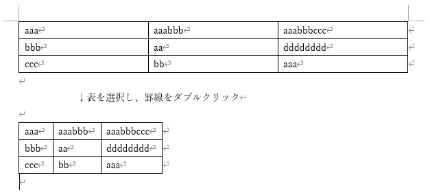

| 枠線を太くする、 色をつけたいといった表のデザインを変更したい場合、「表ツール」タブの「デザイン」と「レイアウト」タブを使います。 
| このタブは、今までありませんでしたが、挿入した表を選択した状態になると出てくるものです。 このように特定の条件で出てくるタブを「コンテキストタブ」と呼びます。 詳しい説明は省きますが、色々と試してみて下さい。

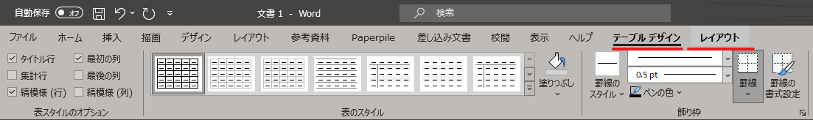

| Excel等で作成した表をコピーして貼り付ける事なども出来ます。

.. note::
    LibreOfficeでも同様に上部のアイコンから表を挿入できます。 コンテキストタブに対応するアイコンはウィンドウの下に出てきます。

画像の挿入
---------------------------
| Wordの文書には、画像ファイルやPDFファイルなどを挿入することができます。

* 挿入したい場所にカーソルを移動し、「挿入」タブにある「図」をクリックし、入れたい画像ファイルを選択。
* フォルダ等で画像を右クリックから(またはCtrl+C等で)コピーし、文章中でペーストする。
* フォルダから画像ファイルをドラッグして文章中にもってくる

| 等のやり方があります。

| 挿入した段階では、図は文字と同じ扱いになり行内に配置されるので、「文字列の折り返し」を設定し、文字と画像の配置を決定します。
| 「文字列の折り返し」は画像を選択した際に表示される右上のアイコンか、画像を右クリックして選択することが出来ます。

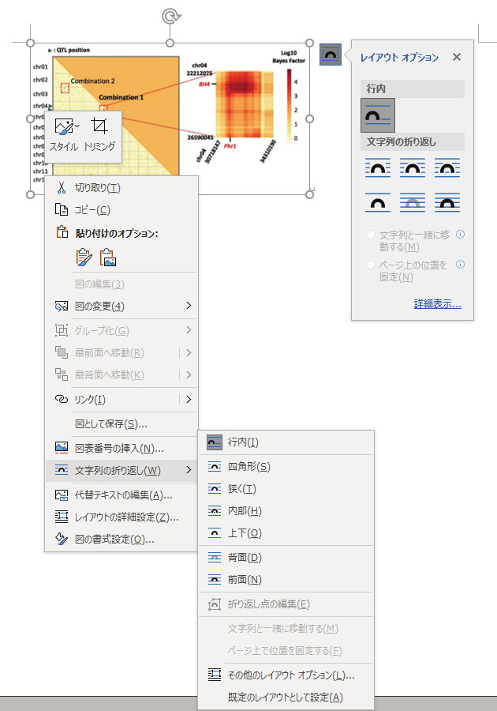

| 「文字列の折り返し」は最初「行内」が設定されていますが、「行内」では図表は一文字として扱われているので、 文章のレイアウトが崩れてしまう事が多いです。
| また、「行内」では画像は一文字扱いで移動が難しいですが、「行内」以外のレイアウトでは、マウスで移動させることが可能です。 
| 通常は「行内」以外のレイアウトを利用した方が文章のレイアウトが整いやすいと思います。

その他の追加要素
^^^^^^^^^^^^^^^^^^^^^^^^^^^^^^^^^^^^^^^^^^^^^^^^^^^^^^^^^^
ページの区切り
---------------------------
| ページに書く内容が終わり、残りを空欄にして、 新しいページから次の文章を始めたい時に使用します。
| 「Enter」や「Space」を押し続けて新しいページに移るのは本来の作成方法ではありません。
| 区切りを入れたい場所にカーソルを移動させた後に、 「挿入」タブから「ページの区切り」をクリックすると、 新しいページが作成されます。

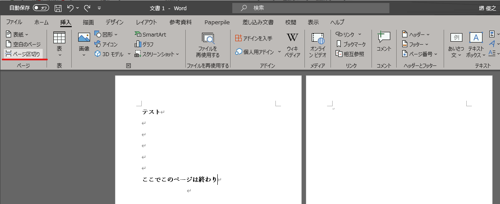

.. note::
    LibreOfficeでは、「挿入」--「改ページ」になります。

ページ番号
------------------------
| 複数ページにわたる文章をWordで作成する場合には、ページ番号を付すのが一般的です。複数枚のレポートや論文の場合は、必ずページ番号を入れましょう。
| 「挿入」タブから「ページ番号」をクリックし、 挿入したいスタイルのものを選択します。その後、「コンテクストメニュー」(ヘッダーとフッター)から細かい編集をします。

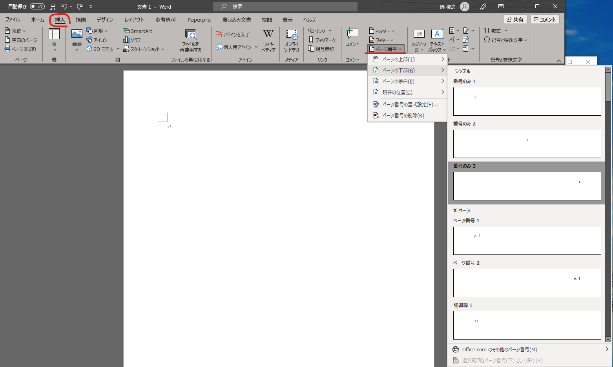

.. note::
    | LibreOfficeでは、「挿入」--「ヘッダーおよびフッター」からヘッダーかフッターを有効にし、ヘッダーもしくはフッターをクリックして編集します。 
    | ページ番号は「ページ番号を挿入する」から挿入できます。

脚注
------------------------
| 文章を書いている中で、文献の参照箇所を指示したり、専門用語の解説などを記載しておきたい場合に脚注を使用します。
| 挿入したい場所にカーソルを移動し、「参考資料」タブにある「右下矢印」をクリックします。脚注か文末脚注にチェックを入れ、書式の設定を行います。
| 「挿入」をクリックし、脚注に情報を入力していきます。脚注はそのページの下、文末脚注は文書の一番最後に入ります。

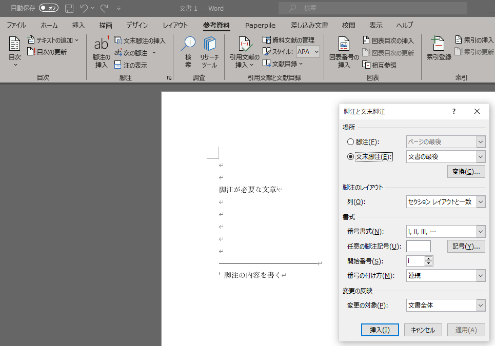

