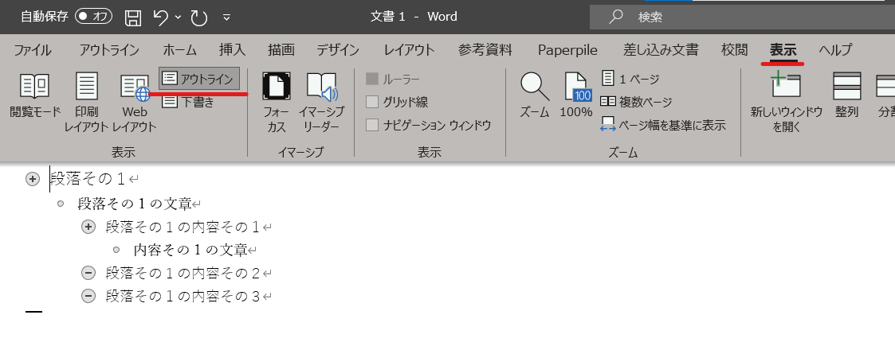
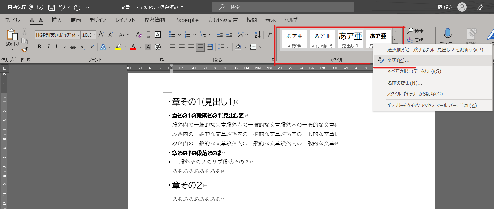
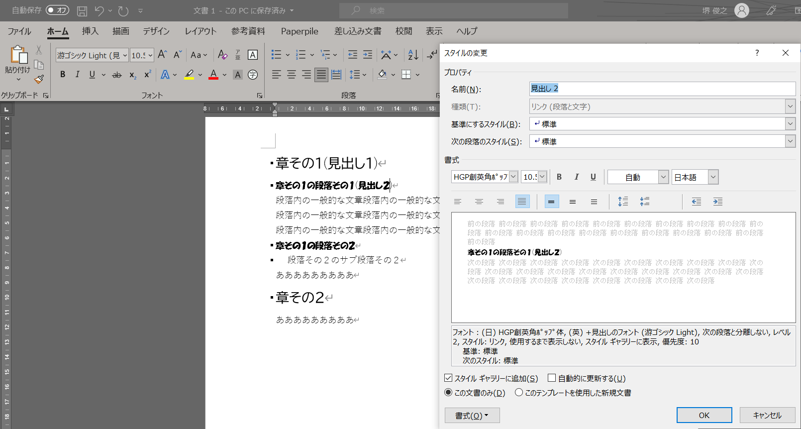
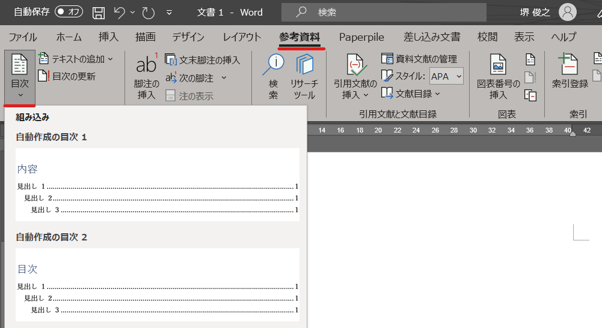

========================
 Word演習 その2
========================

| この章では、長い文章を書く際に便利な機能を紹介します。
| 今すぐに使う訳では無いかもしれませんが、将来論文などを執筆する際に役立つかもしれません。

論理的文章の作成
^^^^^^^^^^^^^^^^^^^^^^
| **文書の「論理構造」**
| 長めのレポートや卒論などの文書は、 内容のまとまり毎に「章」や「節」に分かれています。論文では文章はAbstract・Introduction・Materials and Methods・Results・Discussion・Summaryなどの章に分かれます。
| また、章や節の中でも、さらに小さなまとまりとして「段落」や「箇条書き」が利用されます。
| この様に章や段落等の単位が論理的につなげられることによって、一つの構造を持った文章が構成されています。

| Word には、アウトラインモードというのが組込まれており、この様な論理構造を明確にすることが出来ます。以下のような形になります。
| ある項目にカーソルを置いて「enter」キーを押すと、 その項目と同じ階層の新しい項目ができます。「Tab」キーを押すと、その項目は下位の階層に移動されます。反対に「Shift + Tab」を押すと、その項目は上位の階層に移動します。

.. note::
    | アウトラインの作成に関する機能を一部だけ紹介しました。
    | 興味があれば `論文作成のためのMicrosoft Word2007活用「第１回：アウトラインの作成」 <http://www.bun.kyoto-u.ac.jp/2009gakusei-sien/researchinfo/paper_writing/fukumoto/word2007_01.pdf>`_ なども参考にしてみてください。
    | Word自体のバージョンは古いですが、どの様にアウトライン・スタイル・段落を活用するのかや、その利点が載っています。

**スタイルについて**

| 構造化された文章では、章のタイトルは、ゴシック体のフォントで太字に表示、 箇条書きだったら項目の頭に「・」のマークを置いたりすることで読みやすくすることが多いです。
| また、同じレベルの見出しは統一された外見で通常表示します。このような文書の表示、見た目のことをここでは文書のスタイルと呼びます。

| Wordでは、文章の階層を指定したり、各階層のスタイルを「スタイル」の項目から設定することが出来ます。
| 階層の指定は、変更したい文章をドラッグで選択し、変更したいスタイルの項目(見出し１など)を選択することで指定できます。
| 各階層のスタイルの変更は、変更したいスタイルの上で右クリックし、変更を選択することで編集できます。

.. note::
    LibreOfficeでもメニューの「スタイル」から同様の機能を使うことができます。

| アウトラインモードやスタイルを利用して文章を階層構造にしておくと、デザインの変更を階層毎にまとめて行ったり、目次を自動で作ったりすることが出来て便利です。

.. note::
    | 実験レポートなどでも、論理的構造をしっかり意識することは大事です。
    | ただ、アウトラインモードやスタイルに関しては、長い文章を書く場合には役立つかもしれませんが、そこまで細かい構造の文章を書くことがない実験レポート等では使わなくても良いのかなとは思います。
    | 卒業論文など、長めの文章を書く機会に、この様な機能があることを思い出せれば良いと思います。長い文章になればなるほど便利な機能です。
    
文献の指示と引用
^^^^^^^^^^^^^^^^^^^^^
| レポートでは参考にした文献の情報をきちんと書いておかなければいけません。文献の表記の仕方は学問の領域や学術雑誌によって様式が異なっています。 また日本語文献とその他の言語の文献でも様式が違っていることがあります。基本的には

    1. 著者に関する書誌要素: 著者名、編者名など
    2. 標題に関する書誌要素: 書名、論文のタイトル、雑誌名など
    3. 出版・物理的特徴に関する書誌要素: 出版者、出版年、雑誌の巻数・号数、ページなど
    4. 注記的な書誌情報: 媒体表示、入手方法、入手日付など

| の様な情報が必要です。幾つか例を示しておきます。

* 木下是雄 (1981). 『理科系の作文技術』. 中央公論新社, 中公新書 624, 244p.
* Sakai et al., (2021), *G3 Genes|Genomes|Genetics* , Volume 11, Issue 7, July 2021, jkab130

文献管理ソフトの紹介
^^^^^^^^^^^^^^^^^^^^^
| 今はそれほど論文等の文献を整理する必要は無いかもしれないですが、研究室に配属された後には、大量の文献を収集し整理する必要がある可能性が高いです。
| その様なときに、文献を適切に整理・管理し、引用文献などにも記載しやすくる機能を持った文献管理ソフトというものがあります。

ZoteroやMendeley, EndNoteなどが有名です。有料のものだとPaperpileが(個人的には)おすすめ。

| EndNoteについては京大生であれば無料で利用でき、講習会なども開かれています。
| 2020年度に開催された講習会「文献管理ツールの使い方-EndNote Basic」の録画が公開されています。
| 録画: `録画保管場所のリンク <https://cls.iimc.kyoto-u.ac.jp/portal/site/6c851694-057e-4a42-885e-0f38d4a61af4/page/c7cc5d1d-c671-4380-9f2e-df795a3e4118>`_
| 資料: `資料のリンク <https://repository.kulib.kyoto-u.ac.jp/dspace/handle/2433/255602>`_

その他の文書作成ソフト
^^^^^^^^^^^^^^^^^^^^^^
| Wordが最もポピュラーな文書作成ソフトですが、特に工学系・理学系の分野の人達はTeXやLaTeXなどを使ってレポートや論文を作成することが多い印象です。
| 参考文献リストの作成やプログラムのソースコード掲載など特定の場面で便利だったりします。
| TeX, LaTeXについて説明すると1つの講義が出来るくらいになるので、気になる方は調べてみてください。
| 工学部(電気電子)の情報基礎演習のテキストはLaTeXの使い方が大半を占めていたと思うので気になる方は生協書店などで見てみると良いでしょう。

演習課題
^^^^^^^^^^^^^^^^^^^^^^

| `このファイル <_static/documents/word/sample1.docx>`_ にはスタイル等を適用する前の文章が入っています。
| 残り時間を使って、この文章をWordで良い感じにレイアウトしてみてください。
| スタイルを適用する際の参考に階層(見出し1とか)を書いてますが、このあたりも参考にするかどうかは自由です。アウトラインモードやスタイル機能を使っても良いですし、一行ずつフォントなどを設定しても良いです。
| 一応 `レイアウト例(pdfファイル) <_static/documents/word/sample1_layout.pdf>`_ を置いておきますが、あくまで1例です。重要そうな部分の色を変えたり強調文字にしたり等、自由にレイアウトを変えてみて下さい。
| 操作が分からない所や質問などあれば、何時でも聞いてください。
| **編集したファイルは最初のページの右上に「氏名・所属」を記入してPandaの課題から提出して下さい。**
